# Лаба 1 — Пишем свой докер

Задание: https://github.com/KeladKaal/containerization-and-orchestration/blob/main-rus/lecture-1-docker/lab.md

## Предисловие

Когда все разбивались на команды после вводной лекции, я решил, что буду делать все в соло.

> "Ну... У меня же был курс по операционным сетям на линуксе в баке, справлюсь" — подумал я.

Это конечно было смело... Глупо, но смело😂

В итоге, могу кратко описать свое состояние до и после лабы:

<p>
  
  
</p>

## Часть 0 — Пишем тестовую микро апишку

Вооружившись ТЗ и ИИностранным агентом, собираем простенькую апишку на Go.

Код: [`./api`](./api)

Эндпоинты:
```
GET /health           - должен отдавать ok, если сервис запустился
GET /eat?mb=N&hold=sec - захватывает N мб и держит заданное количество секунд (по умолчанию 30 секунд)
GET /burn?seconds=N    - грузим busy-loop'ом ядро CPU заданное время (по умолчанию 30 секунд)
```

## Часть 1 — Запуск напрямую (5 минут полет нормальный)

Собираем бинарник, запускаем.

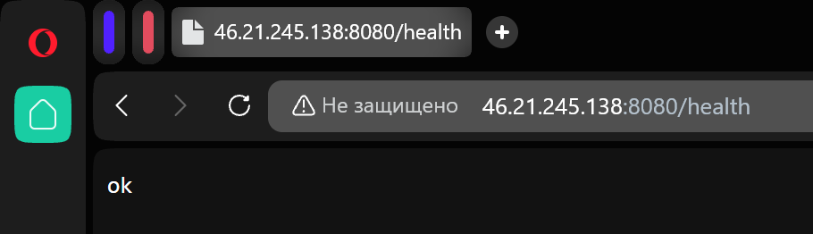

И видим заветный `ok` при попытке достучаться до `/health`.

Поэтому, смотрим pid процесса.

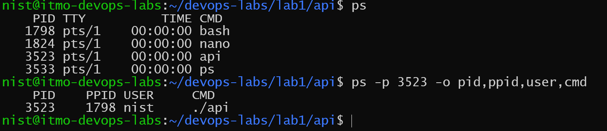

И заодно проверяем работу `/eat` и потребление памяти через:
```bash
ps -p 3523 -o pid,rss,vsz,cmd
```

<p>
  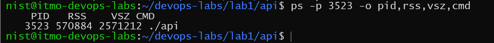
  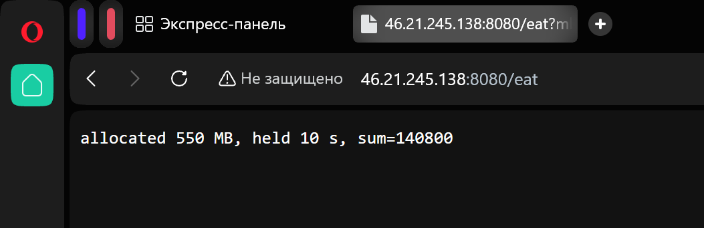
</p>

## Часть 2 — namespaces

А теперь начинается веселье, ради которого мы здесь собрались...

Решив сначала разобраться с простыми неймспейсами, было решено запускать `unshare` без `--net` и `--user`.
Поэтому, разобравшись с тем, как работает `--fork` и зачем нужен `--mount-proc`, получилось это:

```bash
unshare --pid --mount --uts --ipc --fork --mount-proc / /bin/sh -c 'hostname mydocker-ns; exec home/nist/devops-labs/lab1/api/api'
```

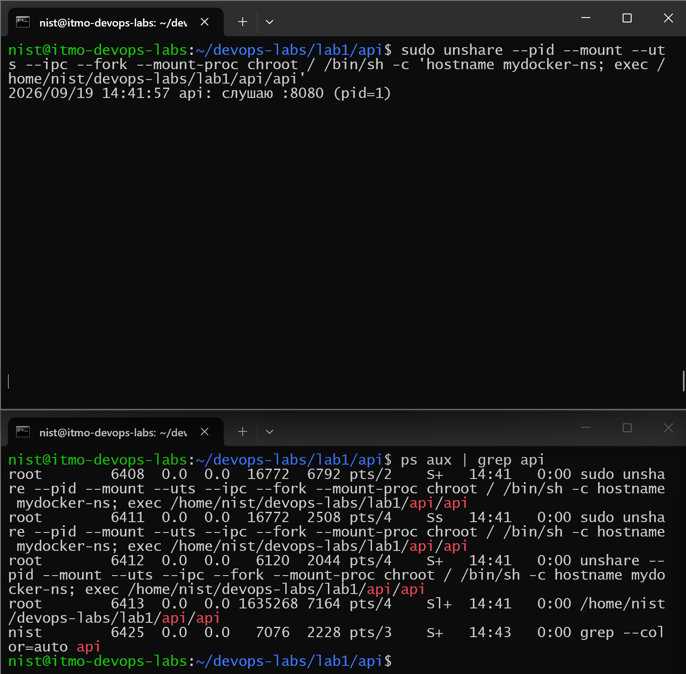

И оно даже работает. Видно, что в кастомном неймспейсе процесс получает `pid = 1`, а снаружи — `6413`.

После данного успеха последовала попытка добить изоляцию сети и пользователя через флаги `--net`/`--user` и...

`Permission denied`


И спустя полчаса разборок и борьбы с облачной ВМкой я понял, что проблема была в маппинге пользователя через `--map-root-user` и запуском `unshare` через `sudo`.

Вторая попытка и...

`unshare: unshare failed: Operation not permitted`

Спустя еще полчаса попыток оттрейсить ошибку были с боем отбиты права:
`sudo sysctl -w kernel.unprivileged_userns_clone=1` и
`sudo sysctl -w kernel.apparmor_restrict_unprivileged_userns=0` у ВМки.
(Понятно, что это временное решение, но нет ничего более постоянного, чем временное)

Третья попытка...

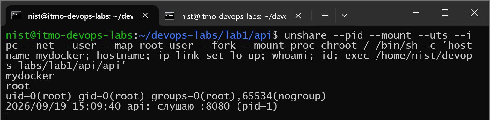

И о чудо, мы видим `pid = 1`, собственный hostname процесса, root пользователя (который на самом деле является рутом только в этом неймспейсе).

А теперь проверяем снаружи:

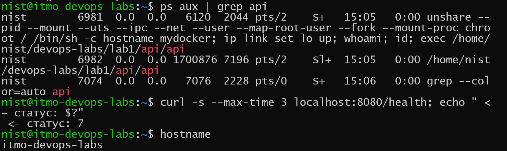

Видим настоящий pid процесса, настоящего пользователя-владельца, настоящее имя хоста, и главное — статус `7` (`Couldn't connect to server`) при попытке `curl`, что подтверждает изоляцию сети.

## Часть 3 — cgroups

Для начала проверяем, где смонтирован cgroup, и получаем `sys/fs/cgroup`.

Создаем собственный cgroup:
```bash
sudo mkdir /sys/fs/cgroup/mydocker
```

### Память и OOM

Ставим лимит по памяти и добавляем процесс в cgroup:

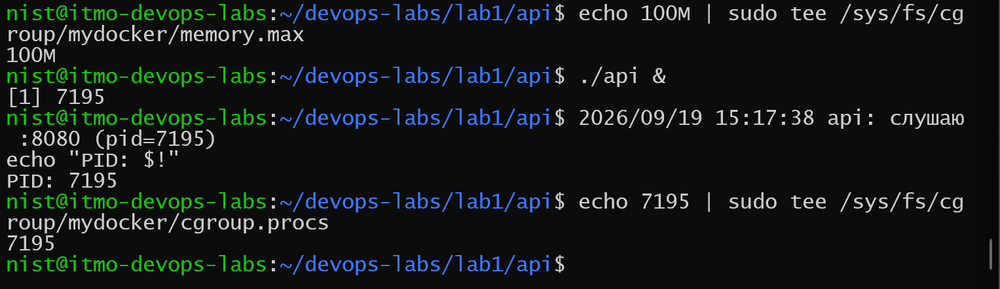

Стучимся к сервису по `/eat?mb=200&hold=10`, требуем захватить 200 мб и закономерно ловим OOM и убитый процесс.

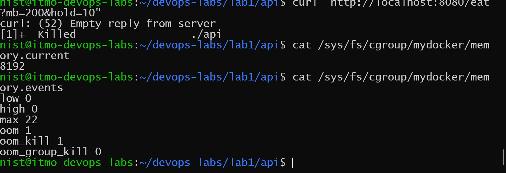

### Процессор и троттлинг

Перезапускаем сервис и теперь ставим ему лимит на использование процессора в пол ядра:

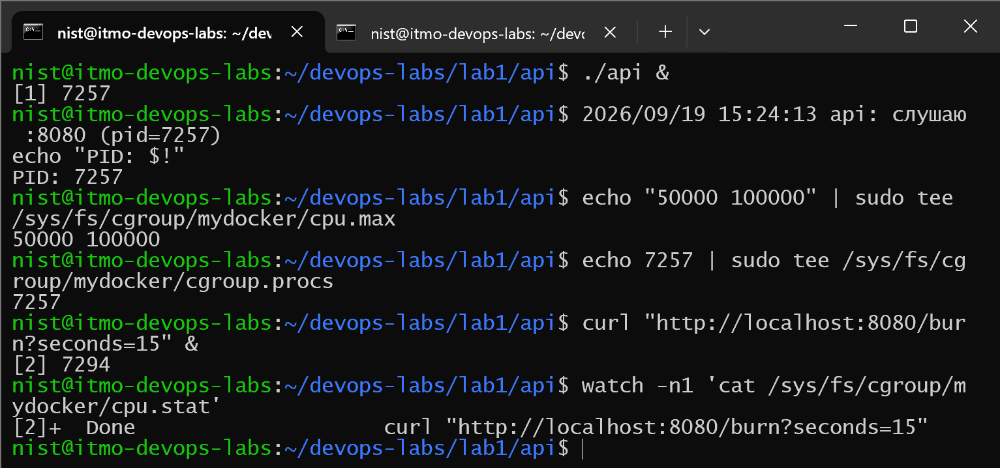

Запускаем `/burn?seconds=15` и смотрим статистику по нагрузке.

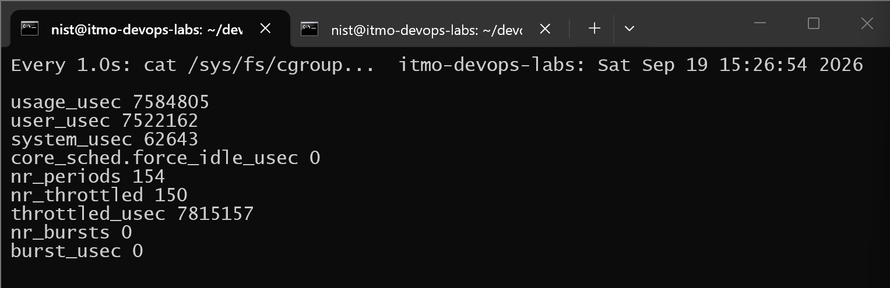

### Процессы и форк-бомба

Опять запускаем сервис и ставим лимит в 20 процессов. Запускаем `stress-ng` с автоматическим выбором количества воркеров (`--fork 0`):

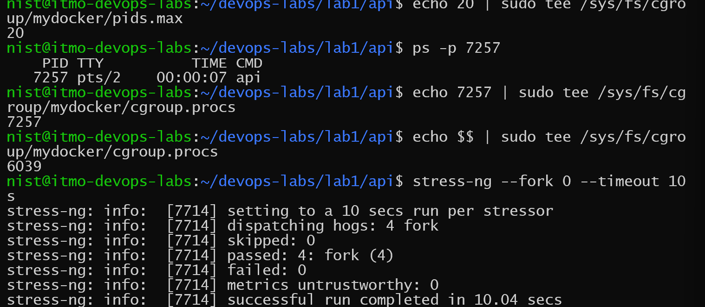

...и все проходит успешно.

Потом до меня дошло, что так количество воркеров берется по количеству ядер на машине, поэтому превышения лимита не случилось. Увеличиваем число параллельных воркеров вручную до 25 и запускаем снова:

```bash
stress-ng --fork 25 --timeout 10s
```

И ждем...

ждем...

ждем...

И вот оно... вылетаем с виртуалки. Но мы не гордые, переподключаемся и сразу же видим 12 зомби-процессов. Проверяем `sys/fs/cgroup/mydocker/pids.events`, видим кучу попыток форков, а `sys/fs/cgroup/mydocker/pids.current` показывает ровно 20.

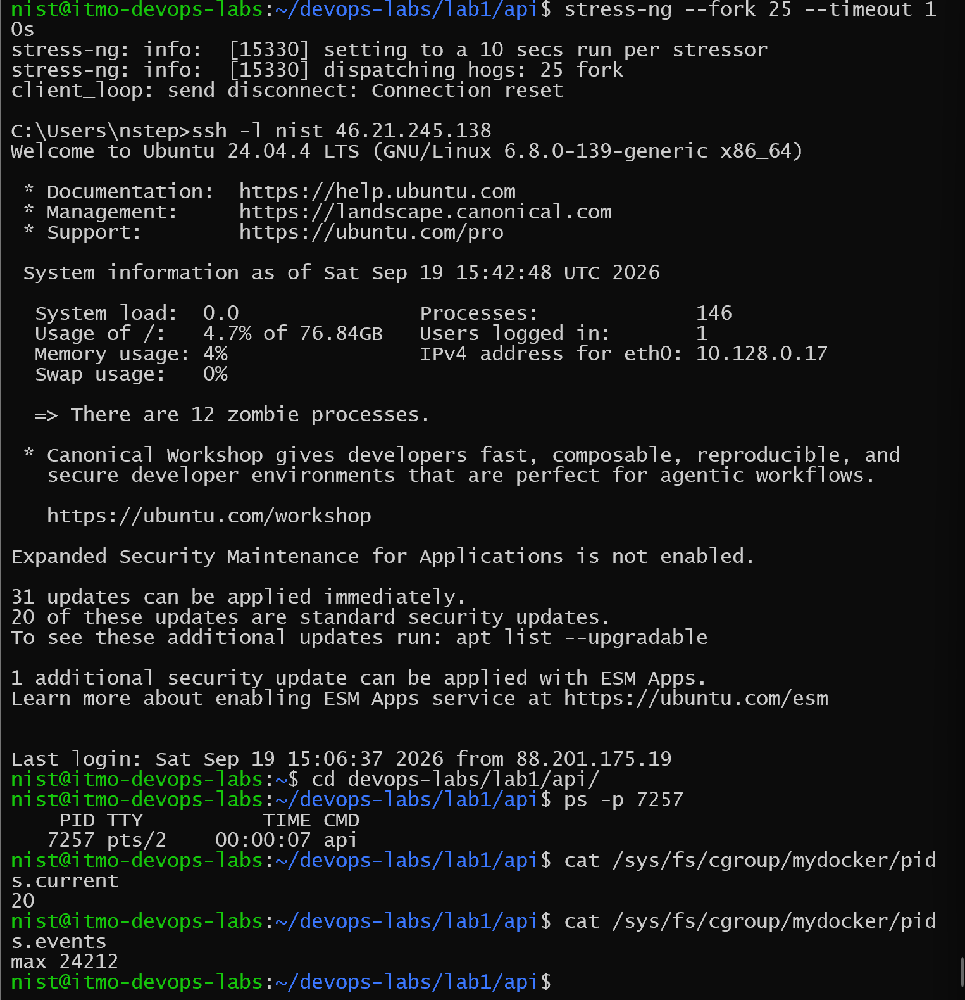

## Часть 4 — Права и seccomp

С правами вроде было просто. Запускаем наш сервис под рутом и видим полный набор capabilities:

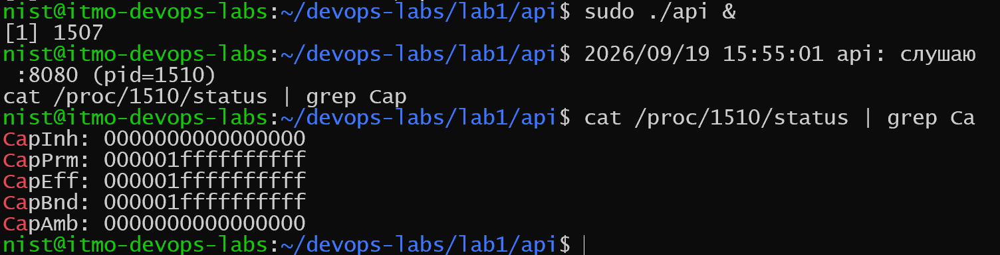

Теперь ограничим их с помощью:
```bash
sudo setpriv --bounding-set=-all --inh-caps=-all ./api &
```

И теперь у сервиса полностью нулевые права, несмотря на sudo:

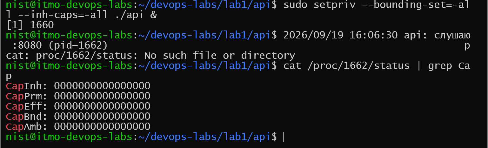

А теперь seccomp-профиль.

Ставим `libseccomp-dev` и пишем C-шную обертку для api: [`./api/seccomp-wrap.c`](./api/seccomp-wrap.c)

Не без ошибок собираем обертку и запускаем ее.

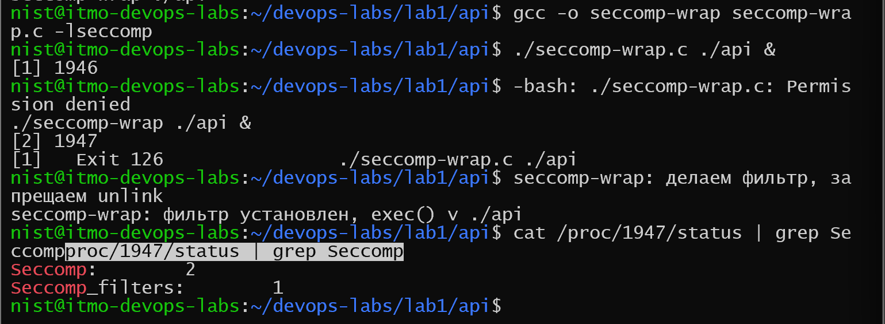
*(чуть поехали команды, но это bash сорри🙂)*

Проверка через `grep` показывает активный фильтр (`Seccomp: 2`, `Seccomp_filters: 1`).

## Часть 5 — Свой докер скрипт

Здесь объединяем все предыдущие шаги в один общий скрипт: [`mydocker.sh`](./mydocker.sh)

Структура:
- Создание cgroup `mydocker` с лимитами (200mb памяти, 50% cpu, 50 процессов максимум).
- Кладем shell, от которого запускаем api, в cgroup, чтобы избежать race condition — созданный api сразу попадает в нужный cgroup как дочерний процесс shell.
- Изолируем все неймспейсы через unshare (pid, uts, ipc, user, net, mount).
- Ограничиваем права через setpriv (делаем полный сброс capabilities).
- Запуск seccomp-обертки с фильтрами для сервиса.

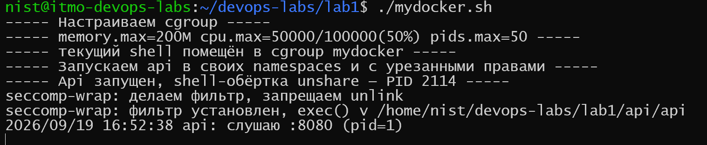

Теперь сравним это с запуском `docker run`:
```bash
docker run --rm --name api-docker \
  --memory=200m --cpus=0.5 --pids-limit=50 \
  --cap-drop=ALL --security-opt no-new-privileges \
  -p 8080:8080 \
  -v "$PWD/api/api":/api:ro \
  debian:bookworm-slim /api
```

Docker сам создал PID namespace, изолирует сеть и пробрасывает наружу порт для доступа к сервису внутри контейнера, устанавливает лимиты.

| | mydocker.sh (свой) | docker run |
|---|---|---|
| Namespaces (pid/mount/uts/ipc/net/user) | Настраивали вручную через `unshare`, каждый флаг явно | То же самое из коробки, автоматически |
| Сеть | `--net` даёт ПУСТУЮ сеть, `/health` снаружи НЕ отвечает без `nsenter` (сами не строили мост) | Docker сам поднимает bridge-сеть (`docker0`), NAT и проброс порта (`-p 8080:8080`) — `curl localhost:8080` работает сразу, без доп. инструментов |
| Capabilities | Урезали вручную через `setpriv --bounding-set=-all` | Docker по умолчанию УЖЕ убирает большую часть опасных capabilities (не даёт полный root-набор, как голый `sudo`), можно тонко настроить через `--cap-drop`/`--cap-add` |
| Seccomp | Писали свой C-код с libseccomp, оборачивали `exec()` | Docker применяет seccomp-профиль ПО УМОЛЧАНИЮ (default profile, блокирует ~44 опасных syscall) без каких-либо действий с нашей стороны; свой профиль подключается через `--security-opt seccomp=profile.json` |
| Файловая система | Использовали `chroot /` — то есть ФС ХОСТА напрямую (не изолированная ФС, никакого образа) | Даже без своего Dockerfile — базовый образ `debian:bookworm-slim` (Union FS) |
| Настройка лимитов | Вручную: `mkdir` cgroup, `echo ... > memory.max/cpu.max/pids.max`, ручное перемещение процесса в cgroup ДО запуска (иначе race condition) | Прямые флаги: `--memory`, `--cpus`, `--pids-limit` — Docker сам создаёт cgroup и настраивает лимиты, без единой ручной команды с `/sys/fs/cgroup` |
| Управление жизненным циклом | `kill <PID>` вручную, нет единого способа "остановить/удалить" | `docker stop`/`docker rm`, единый интерфейс управления, логирование (`docker logs`), рестарт-политики |
| Простота использования | Много ручных шагов, легко забыть флаг или столкнуться с race condition | Одна команда `docker run` с флагами, вся сложность скрыта |

**Вывод**

Docker под капотом вызывает те же механизмы, что использовались по ходу работы, но для конечного пользователя делает это максимально удобным, чтобы избежать заморочек: сам добавляет изолированную ФС, сам делает сетевой мост для доступа снаружи вместо настройки пустого `--net`, и делает это синтаксически чуть проще.

## Часть 6 — Образы

Сначала пишем обычный Dockerfile ([`Dockerfile`](./Dockerfile)) и запускаем `docker build`.

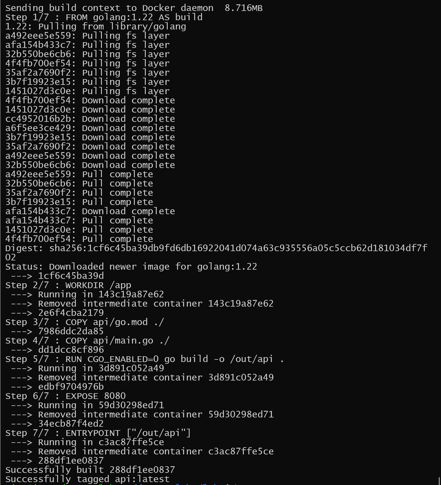

Теперь напишем multistage Dockerfile ([`Dockerfile.multistage`](./Dockerfile.multistage)).

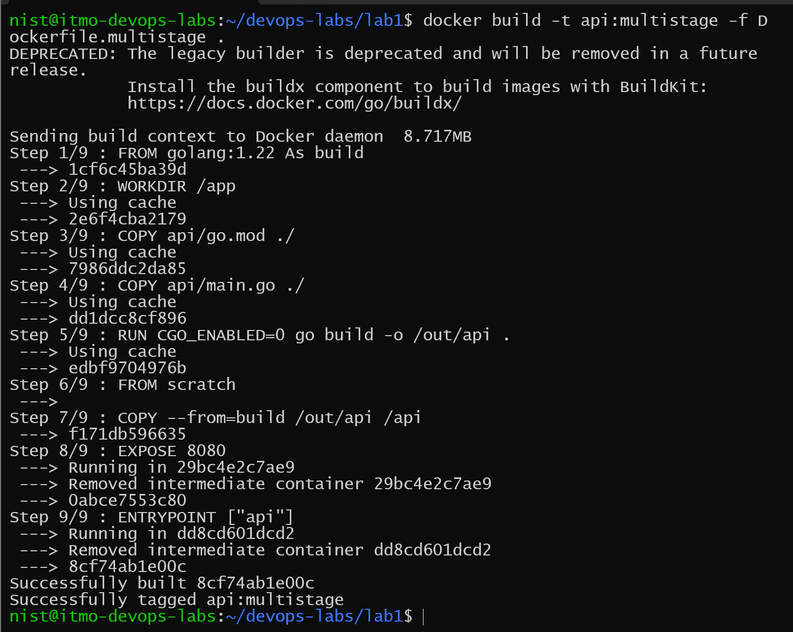

И помимо субъективной, но ощутимой скорости работы второй команды, нужно так же отметить разницу в:
- **Размере**: single — 1.3 Gb | multistage — 11 Mb.
- **Кол-ве слоев**: single — ~15 (включая debian + go toolchain + apt-get слои + сам билд) | multistage — 3 (сам бинарник + expose + entrypoint).
- **Содержимом**: single — тянет за собой компилятор, пакеты, ФС и т.д. | multistage — только бинарник.

**Вывод**

Multistage не просто уменьшает вес получаемого образа, он убирает все ненужные в рантайме утилиты и не дает им физически попасть в готовый образ.

### ФС контейнера

Проверим, как работает ФС контейнера в докере. Сначала создаем контейнер без подключенного тома и запишем туда файл.

Теперь если мы удалим этот контейнер и запустим заново с тем же образом:

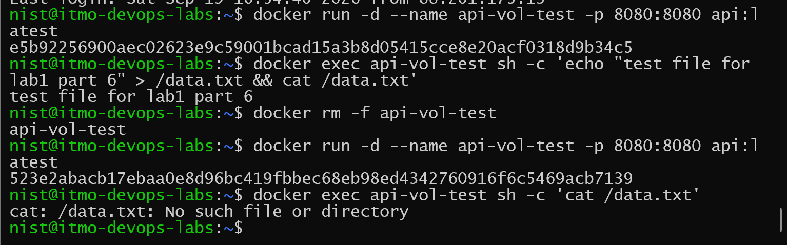

И вот, файла нет. Потому что без тома файлы записываются во writable-слой контейнера, который живет ровно столько же, сколько он сам.

А вот если мы добавим к контейнеру том, уже в него запишем файл и пересоздадим контейнер:

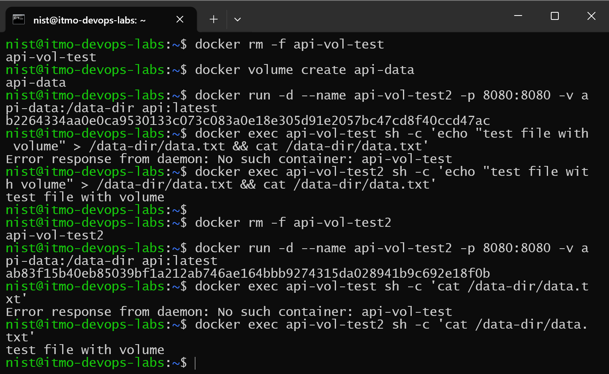

То теперь мы можем получить доступ к ранее созданному файлу, потому что том живет независимо от контейнера в ФС хоста. Том монтируется в контейнер на этапе запуска.

## Часть 7 — Гипервизор

Ну а тут мы идем на уровень глубже и смотрим на gVisor (`runsc`) — это песочница, которая ставится вместо обычного `runc` рантайма в докере и подменяет собой часть работы с ядром.

Ставим `runsc`, регистрируем его как рантайм в докере (`runsc install` сам правит `/etc/docker/daemon.json`) и перезапускаем демон. Дефолтным рантаймом всё ещё остаётся `runc`, `runsc` просто становится доступен как опция через `--runtime=runsc`.

Запускаем наш образ под gVisor:
```bash
docker run -d --runtime=runsc --name api-gvisor -p 8080:8080 api:latest
```

`/health` отвечает `ok` как ни в чём не бывало — то есть сервису вообще всё равно, под каким рантаймом его подняли, разницу видно только "изнутри".

А теперь самое интересное — спрашиваем у контейнеров, какое у них ядро:

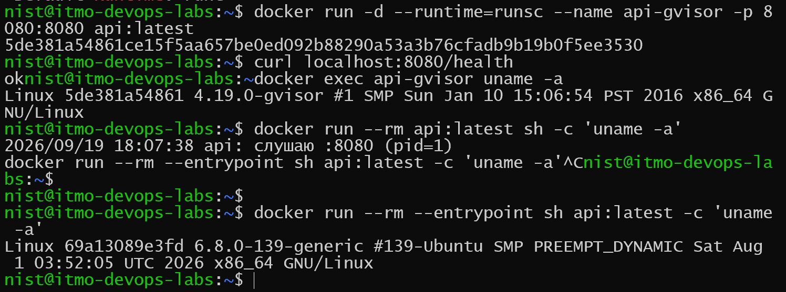

Под gVisor `uname -a` выдает `4.19.0-gvisor` — это вообще выдуманная версия ядра, которой не существует на хосте. А если тот же самый образ запустить обычным `docker run` (без `--runtime`), `uname -a` покажет настоящее ядро хоста (тот же `6.8.0-...generic`, что и на самой VM).

Смысл в том, что под `runc` контейнер дергает syscalls напрямую в настоящее ядро хоста — namespaces/cgroups/capabilities/seccomp лишь ограничивают, что ему видно и что можно делать, но ядро одно на всех, со всеми его потенциальными багами. А под `runsc` между контейнером и реальным ядром сидит отдельный userspace-процесс `sentry`, который сам реализует урезанный набор Linux-синтаксисов — грубо говоря, "притворяется ядром". Поэтому `uname` внутри отвечает не настоящее ядро, а sentry — он и подсовывает выдуманную версию. Если в реальном ядре есть syscall-баг, контейнер под gVisor до него просто не дотянется напрямую, потому что общается не с ядром, а с прослойкой.

**Что все равно остается общим с хостом**

Даже под gVisor контейнеры на одной машине всё ещё сидят на одном физическом железе (CPU, память, диск) и в конечном счете на одном хостовом ядре — sentry сам не может выполнять вообще всё сам с нуля, часть операций он всё равно проксирует в реальное ядро (через ограниченный интерфейс, обычно ptrace или KVM). Главное ограничение в том, что контейнер — это не полноценная виртуалка со своим собственным ядром: он либо делит ядро хоста напрямую (runc), либо частично прикрывается прослойкой (gVisor), но в обоих случаях граница слабее, чем у настоящей VM с hardware-виртуализацией (VT-x/AMD-V). Поэтому там, где нужна прямо серьезная изоляция, берут что-то посерьезнее — Kata Containers или полноценные VM, а не только gVisor.

## Часть 8 — Стек мониторинга

Ну и в финале поднимем стек мониторинга и снимем метрики с нашего сервиса.

Стартуем контейнер с api:
```bash
docker run -d --name api-monitored --memory=200m --cpus=0.5 --pids-limit=50 -p 8080:8080 api:latest
```

Контейнер с cAdvisor:
```bash
docker run -d --name cadvisor --volume=/:/rootfs:ro --volume=/var/run:/var/run:ro --volume=/sys:/sys:ro --volume=/var/lib/docker/:/var/lib/docker:ro --volume=/dev/disk/:/dev/disk:ro --publish=8081:8080 --privileged --device=/dev/kmsg gcr.io/cadvisor/cadvisor:latest
```

Prometheus:
```bash
docker run -d --name prometheus --network=host -v ~/prometheus.yml:/etc/prometheus/prometheus.yml prom/prometheus
```

Настраиваем конфиг и ждем, когда же он скажет заветное `target: up`.

И наконец Grafana:
```bash
docker run -d --name grafana --network=host grafana/grafana
```

Идем в браузер и стучимся на 3000 порт. Нас встречает интерфейс Grafana.

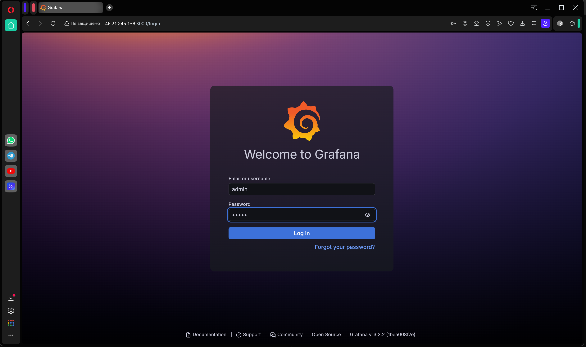

Сделаем дашборд для сбора нужных метрик. Собирать будем:
- **Memory Usage**: `container_memory_usage_bytes{name="api-monitored"}`. Чтобы мониторить скачки по потреблению и отлавливать приближение OOM, когда сервис может упасть по памяти.
- **CPU Usage**: `rate(container_cpu_usage_seconds_total{name="api-monitored"}[1m])`. Мониторим текущую нагрузку на CPU, чтобы понимать, насколько сервис вообще переваривает нагрузку, и вовремя поймать момент, когда процессора скоро перестанет хватать, допустим, на количество пользователей в моменте.
- **CPU Throttling**: `rate(container_cpu_cfs_throttled_seconds_total{name="api-monitored"}[1m])`. Смотрим на показатель троттлинга процессора, чтобы понимать нехватку процессорного времени относительно реальной нагрузки и избежать момента, когда сервис "как живой, но не живой" и работает с неохотой.

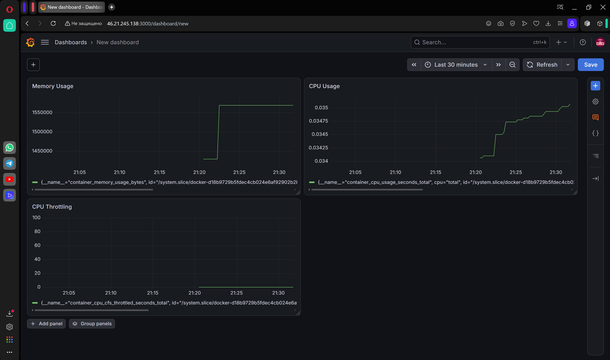

А теперь запустим `/eat` и `/burn`, чтобы посмотреть, как это отразилось на метриках.

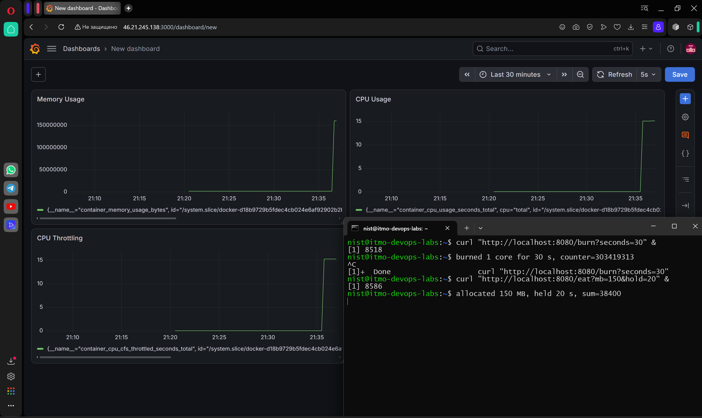
