# Лаба 2 — Наблюдаемость: метрики, логи, трейсы и алерты

Задание: https://github.com/KeladKaal/containerization-and-orchestration/blob/main-rus/lecture-2-observability/lab.md

## Предисловие

После первой лабы я был уверен, что самое страшное позади. Там были линуксовые механизмы, namespaces и cgroups, а тут уже готовые инструменты: Prometheus, Grafana, Loki, Jaeger. Ставишь чарты, смотришь графики, профит.


А там... YAML-конфиги, умирающие port-forward'ы и веселье.

## Часть 0 — Сервис и доставка в кластер

### API

Снова собираем микро сервис на Go, который специально должен отдавать эндпоинты, которые имитируют плохую работу сервиса.

Код: [`./api`](./api)

Эндпоинты:
```
GET /health        - отдаёт ok
GET /fail          - всегда отвечает 500 на запрос
GET /slow          - имитирует медленный запрос (спит 1-3 секунды)
GET /load?n=N      - делает N запросов к /health сам себе
GET /metrics       - отдает метрики для Prometheus
```

Внутри сервис отдает:
- RED-метрики (Rate, Errors, Duration) через `prometheus/client_golang`;
- JSON-логи с `trace_id` и `span_id`;
- трейсы через OpenTelemetry. Экспорт включается, только если задана переменная `OTEL_EXPORTER_OTLP_ENDPOINT`.

Dockerfile с multistage сборкой: `golang` для сборки, `distroless` для запуска.

### Кластер и образ

Поднимаем minikube. Сразу указываю ограничение по ресурсам, потому что дефолтных 2 CPU / 2 GB на весь стек мониторинга не хватит. Однако, ВМ тоже не резиновая, поэтому только 3 CPU / 6GB: 

```bash
minikube start --driver=docker --cpus=3 --memory=6g --disk-size=40g
minikube image build -t api:0.1.0 .
```

Уже здесь пришлось разбираться почему Kubernetes не работает. Оказалось, что с `latest` Kubernetes по умолчанию ставит `imagePullPolicy: Always` и идёт искать образ в Docker Hub и под ловил `ErrImagePull`, хотя локально образ собран. Так что, пришлось поменять тег на `0.1.0`.

### Helm-чарт

Делаем скелет через `helm create api` и выкидываем всё лишнее: ingress, hpa, serviceaccount, тесты:
```bash
helm create api
rm -rf api/templates/{ingress.yaml,hpa.yaml,serviceaccount.yaml,httproute.yaml,tests}
```

И заодно в `values.yaml` правим:
- образ `nginx` → `api:0.1.0`;
- порт `80` → `8080`;
- пробы с `/` на `/health`. На `/` сервис отдаёт 404, и liveness перезапускал бы под по кругу;
- `resources`. На всякий случай поставил небольшие requests и лимит памяти, чтобы уложиться в ограничения по железу (Мало ли что 🤷‍♂️).

А дальше проверки через `helm lint`, правка ошибок, опять ошибки по невнимательности и снова правки. Потом кривой манифест, который проходит `helm lint` без ошибок. Но в итоге, все работает.

### Установка и проверка

```bash
helm install api ./api -n app --create-namespace
kubectl -n app port-forward svc/api 8080:8080 &
curl localhost:8080/health; 
curl -i localhost:8080/fail; 
curl localhost:8080/slow
curl -s localhost:8080/metrics | grep '^http_'
```

`/health` → ok, `/fail` → 500, `/slow` → 1.8 с, метрики считаются.
И оказалось, что пробы liveness и readiness постоянно дергают `/health` с частотой 0.2с, эти фоновые реквесты потом будет видно на дашборде. 

## Часть 1 — Метрики (Prometheus + Grafana)

### kube-prometheus-stack

Ставим всё одним чартом: Prometheus, Grafana, Alertmanager и оператор, который ими управляет. Настройки лежат в [`helm/values/kube-prometheus-stack.yaml`](./helm/values/kube-prometheus-stack.yaml).

Самое важное там:
- `serviceMonitorSelectorNilUsesHelmValues: false`. Без этого Prometheus видит только ServiceMonitor'ы с меткой `release: kps` и игнорирует используемый здесь;
- `scrapeInterval: 15s`, чтобы в окне `rate(...[1m])` было 4 точки;

```bash
helm repo add prometheus-community https://prometheus-community.github.io/helm-charts && helm repo update
helm template kps prometheus-community/kube-prometheus-stack -n monitoring -f ~/devops-labs/lab2/helm/values/kube-prometheus-stack.yaml
helm install kps prometheus-community/kube-prometheus-stack -n monitoring --create-namespace -f ~/devops-labs/lab2/helm/values/kube-prometheus-stack.yaml
```

### ServiceMonitor

Добавляем в чарт [`servicemonitor.yaml`](./helm/api/templates/servicemonitor.yaml): выбираем наш Service по меткам, порт `http`, путь `/metrics`. Цепочка такая: ServiceMonitor → Service → EndpointSlice → Prometheus скрейпит каждый под напрямую.

Обновляем helm и прокидываем порты, чтобы на своей машине открывать все UI через localhost.

```bash
helm upgrade api ./api -n app
kubectl -n monitoring port-forward svc/kps-kube-prometheus-stack-prometheus 9090:9090 &
kubectl -n monitoring port-forward svc/kps-grafana 3000:80 &
```

Проверяем в Prometheus: `serviceMonitor/app/api/0` в статусе `UP`.

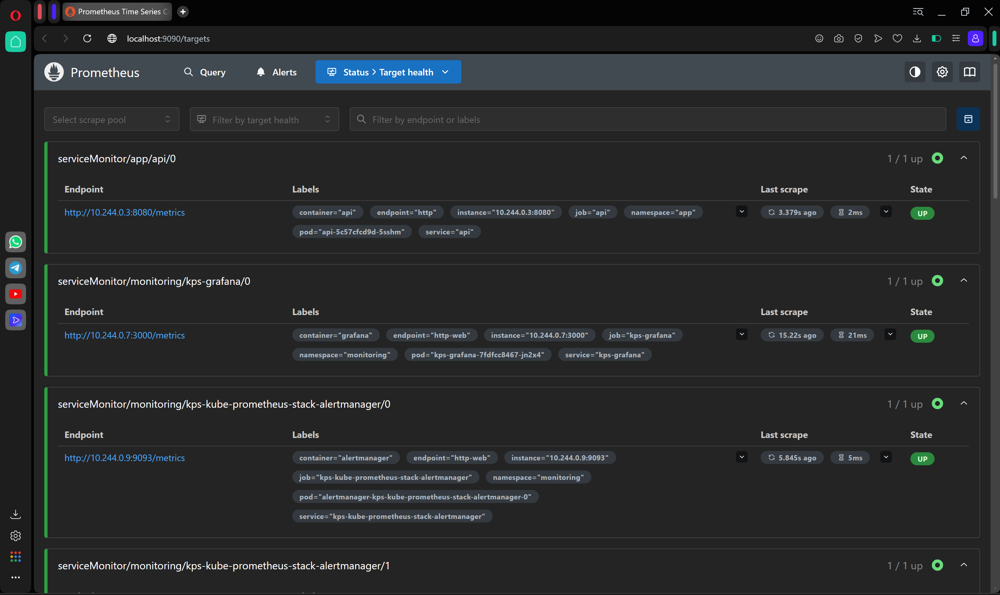

### Дашборд RED

Собираем в Grafana три панели:
- **Rate**: `sum by (endpoint) (rate(http_requests_total{namespace="app", service="api"}[$__rate_interval]))` - сколько запросов в секунду;
- **Errors**: `sum(rate(http_errors_total{...}[...])) / sum(rate(http_requests_total{...}[...]))` - **доля** ошибок;
- **Duration p95**: `histogram_quantile(0.95, sum by (le, endpoint) (rate(http_request_duration_seconds_bucket{...}[...])))` - 95-й перцентиль времени ответа.

Вместо фиксированного окна `[...m]` берем `$__rate_interval`. Grafana сама подберёт окно так, чтобы оно было не меньше шага графика.

В какой-то момент Grafana просто перестала отвечать. Оказалось, что из-за слишком жестким лимитов, которые я прописал в конфиге она словила OOM. Поэтому увеличив лимиты, перезапускаем ее.

И вот первая версия дашборда:

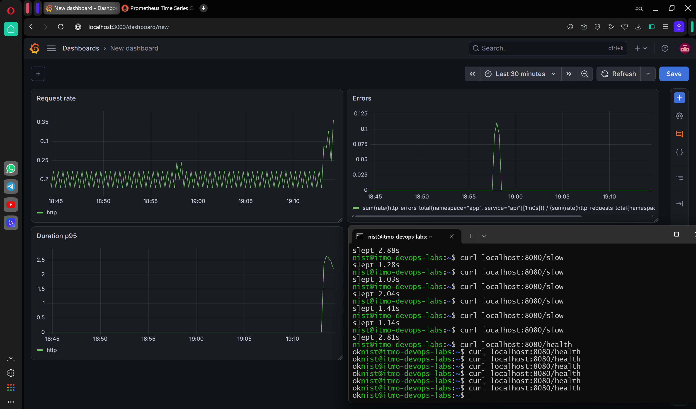

Здесь я заметил, что все запросы на графике слились в одну линию, вместо разбивки по эндпоинтам. Причина оказалась в конфликте меток. Prometheus Operator вешает на цель метку `endpoint="http"`. В приложении метка тоже называется `endpoint`. При конфликте по умолчанию побеждает метка цели, а та, которую отдавал сервис переименовалась в `exported_endpoint`. 
Исправилось это одной строкой `honorLabels: true` в ServiceMonitor.

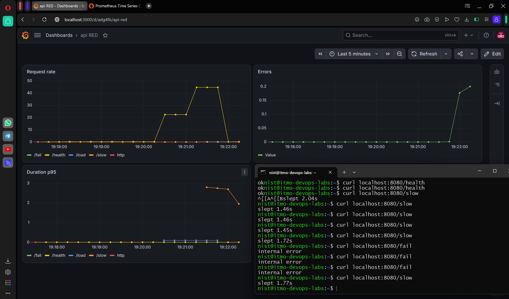

Теперь видно всё: ступеньки от `/load`, p95 у `/slow` около 2-3 секунд, всплеск ошибок от `/fail`.

### Дашборд как код

Заодно экспортировал JSON дашборда в [`helm/api/dashboard/`](./helm/api/dashboard) и добавил его в ConfigMap с меткой `grafana_dashboard: "1"` ([`dashboard.yaml`](./helm/api/templates/dashboard.yaml)). Чтобы при перезапуске кластера Sidecar Grafana сам находил конфиг с готовым дашбордом и ставил его вместе с чартом, без надобности каждый раз делать его руками.

## Часть 2 — Логи (Loki + Alloy)

Путь одной строчки лога:

```
api → stdout → containerd пишет файл на ноде → Alloy читает файл → Loki → Grafana
```

Важная разница с Prometheus: Prometheus сам ходит за метриками (pull), а в Loki логи кто-то должен принести (push). Этим занимается Alloy — он запущен как DaemonSet, по одному поду на ноду.

Что настроил:
- [`loki.yaml`](./helm/values/loki.yaml) — самый простой режим `SingleBinary`, хранение в файлах, логи живут 48 часов;
- [`alloy.yaml`](./helm/values/alloy.yaml) — находим поды своей ноды, читаем их файлы, разбираем формат containerd (`stage.cri`), для `api` парсим JSON;
- datasource Loki добавил прямо в values kube-prometheus-stack;

Главный вопрос тут — что делать меткой. В Loki каждая уникальная комбинация меток — это отдельный поток со своим индексом. Поэтому:
- `level` (2-3 значения) → метка, по ней удобно фильтровать;
- `trace_id` (уникальный на каждый запрос) → structured metadata.

```bash
helm repo add grafana https://grafana.github.io/helm-charts && helm repo update
helm install loki grafana/loki -n monitoring -f ~/devops-labs/lab2/helm/values/loki.yaml
helm install alloy grafana/alloy -n monitoring -f ~/devops-labs/lab2/helm/values/alloy.yaml
helm upgrade kps prometheus-community/kube-prometheus-stack -n monitoring -f ~/devops-labs/lab2/helm/values/kube-prometheus-stack.yaml
```

Два вида запросов в LogQL:
```
{namespace="app", app="api", level="ERROR"}                               # по индексу, быстро
{namespace="app", app="api"} | json | msg="simulated failure in /fail"    # разбор JSON на лету
```

Добавляем панель Logs с ошибками прямо на дашборд RED:

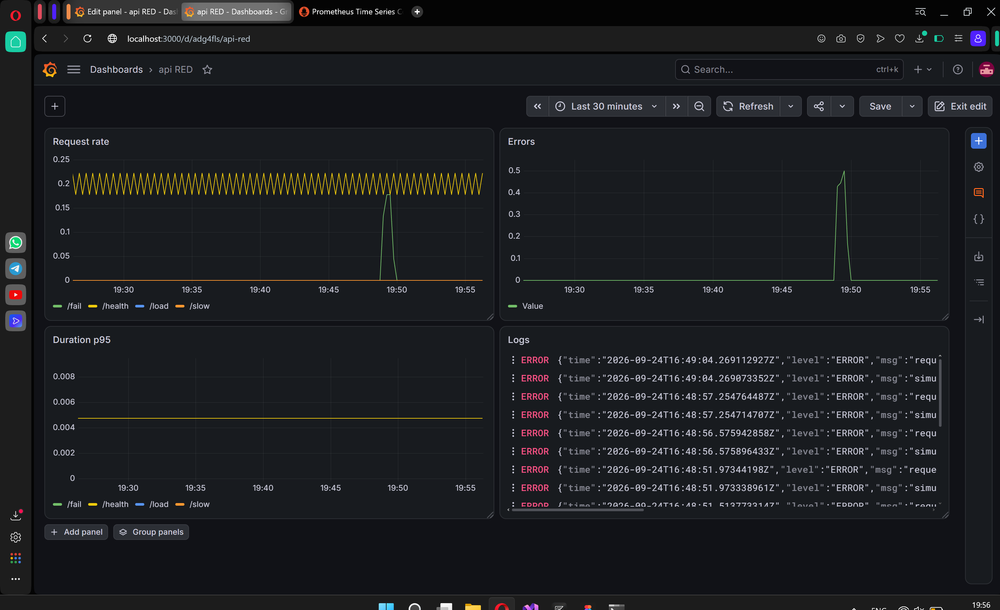

Всплеск ошибок на графике и строки `ERROR` в логах теперь на одном экране.

## Часть 3 — Трейсы (OpenTelemetry + Jaeger)

Цепочка:
```
api (OTel SDK) → копит спаны пачками → OTLP/HTTP :4318 → Jaeger → UI :16686
```

Jaeger ставим в режиме all-in-one с хранением в памяти ([`jaeger.yaml`](./helm/values/jaeger.yaml)). В `values.yaml` чарта api прописываем `OTEL_EXPORTER_OTLP_ENDPOINT`.

```bash
helm repo add jaegertracing https://jaegertracing.github.io/helm-charts && helm repo update
helm install jaeger jaegertracing/jaeger -n monitoring -f ~/devops-labs/lab2/helm/values/jaeger.yaml
helm upgrade api ./api -n app
helm upgrade kps prometheus-community/kube-prometheus-stack -n monitoring -f ~/devops-labs/lab2/helm/values/kube-prometheus-stack.yaml
kubectl -n monitoring port-forward svc/jaeger 16686:16686 &
```

И тут начался детектив.

Сначала не открывался Jaeger UI. Выяснилось, что port-forward умер, потому что я перепутал название сервиса `jaeger-query` вместо `jaeger`, потому что он поднят в режиме all-in-one. Поправил адрес.

UI открылся, но трейсов от `api` нет. Есть только трейсы самого Jaeger. Лезем в логи пода и смотрим строки, которые не JSON (это stderr от OTel SDK):

```bash
kubectl -n app logs deploy/api | grep -v '^{' | tail
```

А там `lookup jaeger-collector.monitoring.svc: no such host`. Я поправил адрес в одном месте, но забыл в `values.yaml` чарта api.

Самое коварное: OTel SDK не роняет приложение, если экспорт сломан. Он просто молча выбрасывает спаны. Сервис живой, всё зелёное, а трейсов нет.


Поправил адрес, и трейсы пошли:

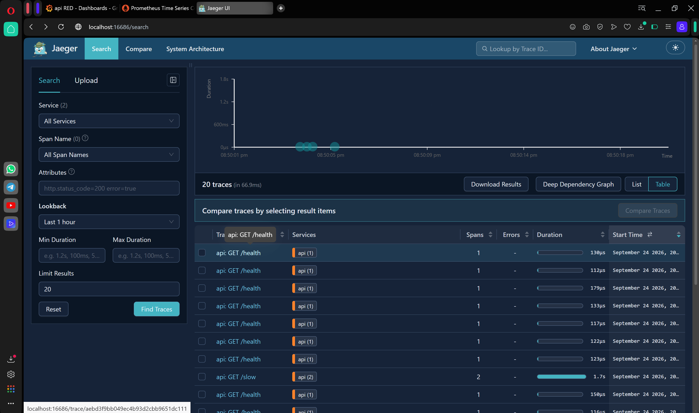

Трейс `/slow`: корневой спан запроса и вложенный `slow-op`, который и съедает всё время.

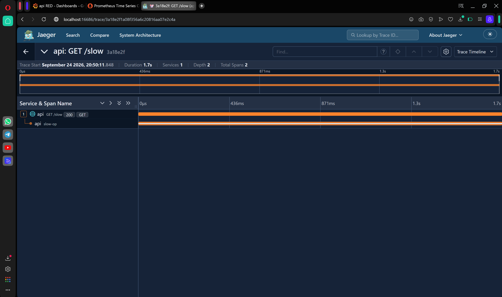

Трейс `/fail`: спан красный, статус 500.

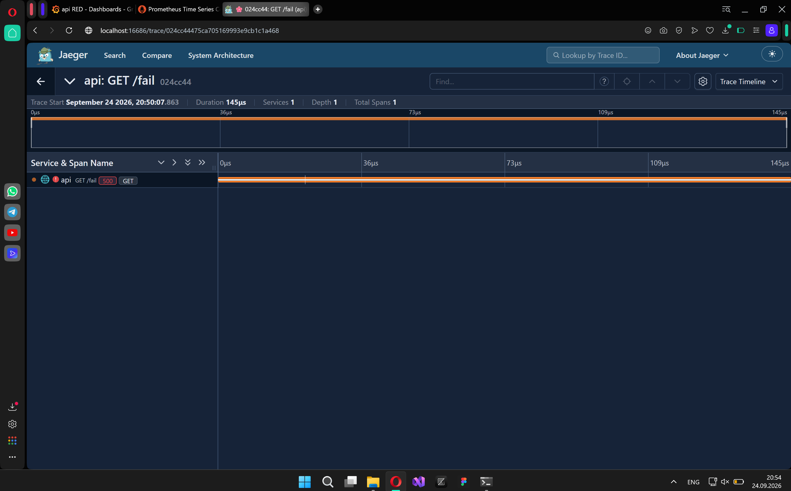

### Из лога в трейс

Вишенка на торте: связываем логи и трейсы. В datasource Loki добавляем `derivedFields`: берём `trace_id` из строки лога и делаем из него ссылку на Jaeger. Теперь у строки лога с ошибкой есть кнопка **Open in Jaeger**:

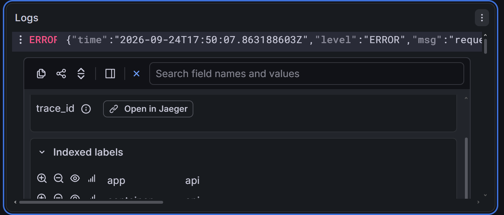

Жмём и попадаем прямо в трейс этого запроса:

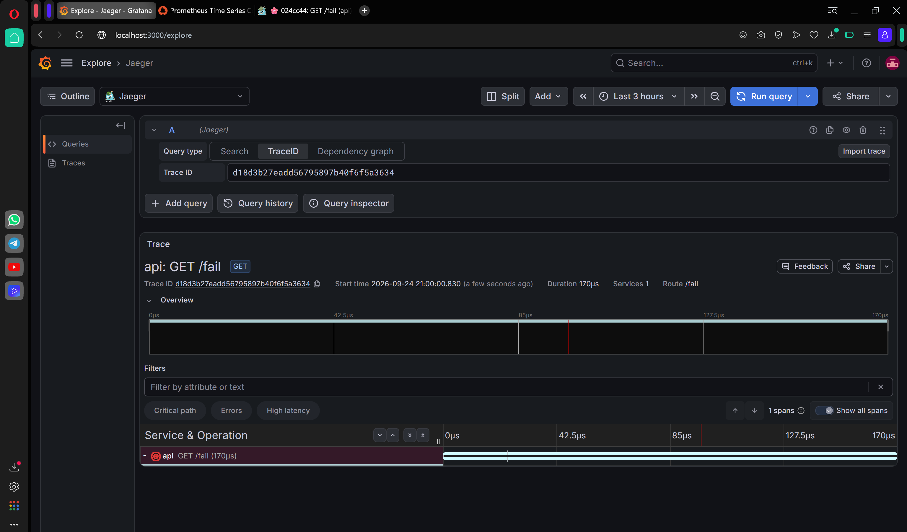

Кнопка сначала, конечно, вела в `no such host`. Старый адрес `jaeger-query` остался ещё и в datasource. Третье место, где я забыл его поправить.

## Часть 4 — Алерты

### Правила

Пишем [`prometheusrule.yaml`](./helm/api/templates/prometheusrule.yaml) с тремя алертами:

- **ApiHighErrorRate** — больше 5% ответов 5xx в течение 2 минут. Именно доля, а не количество: 10 ошибок в секунду при 10k RPS — шум, а при 20 RPS — авария;
- **ApiHighLatencyP95** — p95 дольше 1 секунды в течение 2 минут. Служебный `/load` не учитываем;
- **ApiDown** — `absent(up{...} == 1)` в течение 1 минуты. Почему не просто `up == 0`? При 0 реплик под исчезает, цель пропадает, и ряда `up` просто нет. Сравнивать не с чем, и `up == 0` никогда не сработает.

У каждого алерта в аннотациях есть `summary`, `description` и `runbook` — что делать дежурному, когда его разбудят в 3 ночи.

Правила подхватились сразу:

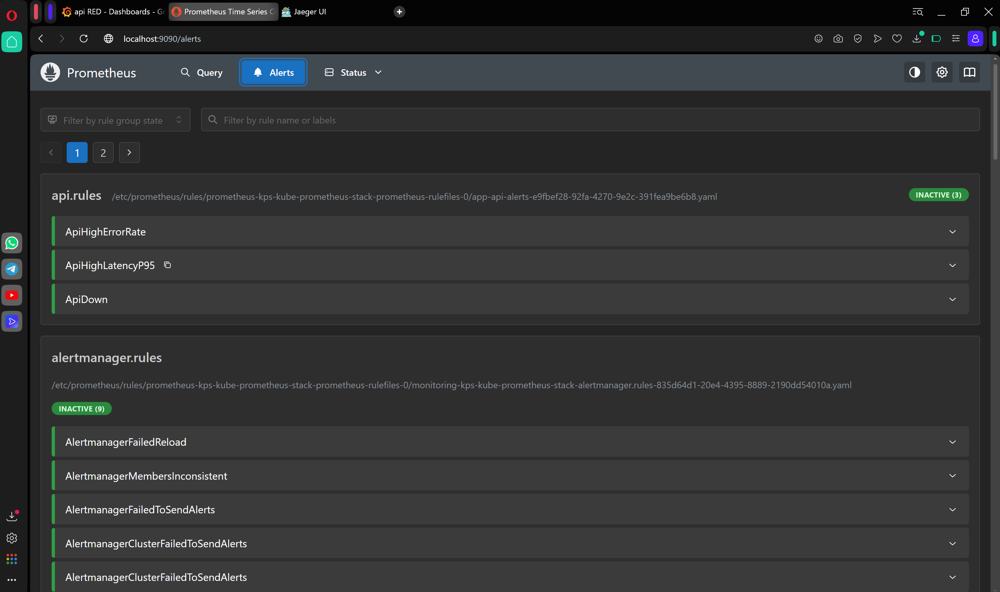

### Куда слать

Почту пришлось бы настраивать через SMTP. Telegram не завёлся, из-за того, что на облаке яндекса не хотелось поднимать три заветных буквы. Поэтому выбрал **webhook**: маленький echo-сервер ([`helm/alert-webhook`](./helm/alert-webhook)), который печатает в лог тело каждого запроса.


В Alertmanager настроил маршруты: `Watchdog` → в `null`, всё с `severity="critical"` → в webhook.

Тут тоже не обошлось без приколов: `helm install alert-webhook` прошёл успешно, а подов нет. Оказалось, я не заметил, что не перенес папку с шаблонами, а Helm спокойно ставит чарт без единого шаблона и не ругается.

### Проверяем все три алерта

Для каждого алерта даём нагрузку по несколько минут: от старта потока до Firing проходит около 3 минут (окно `rate[2m]` + `for: 2m`).

**ApiHighErrorRate** — гоняем `/fail` в цикле:

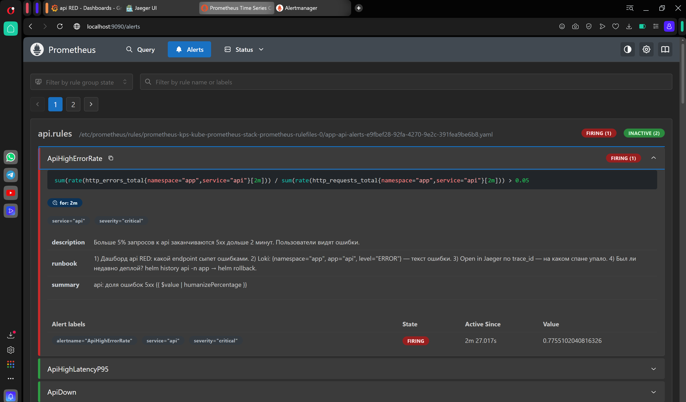

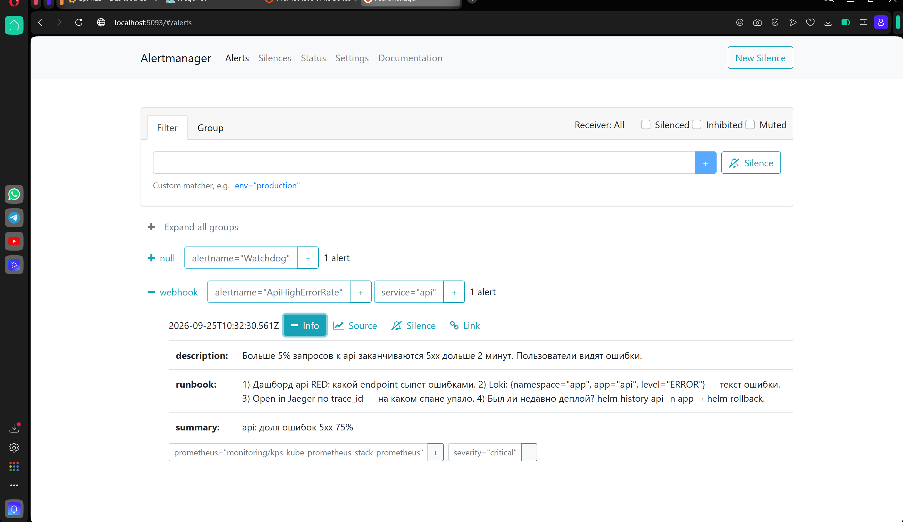

В webhook прилетел JSON с `"status":"firing"` и `summary: "api: доля ошибок 5xx 75%"`. Алерт появился в `10:32:30`, а POST пришёл в `10:33:00` — ровно через `group_wait: 30s`.

**ApiHighLatencyP95** — гоняем `/slow` в 5 потоков:

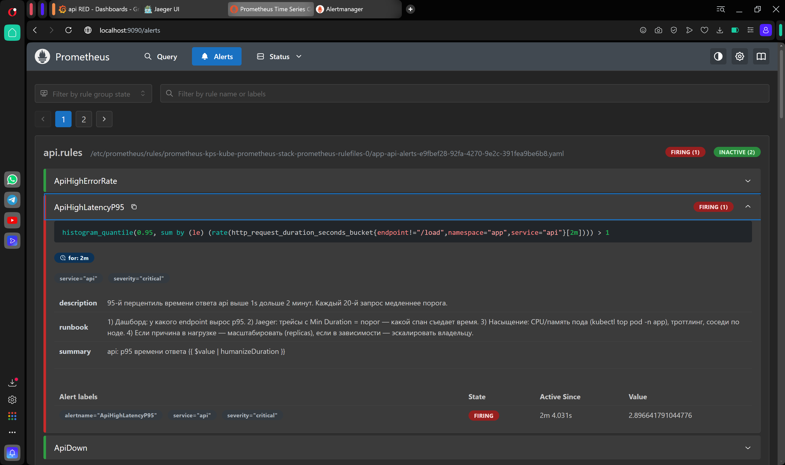

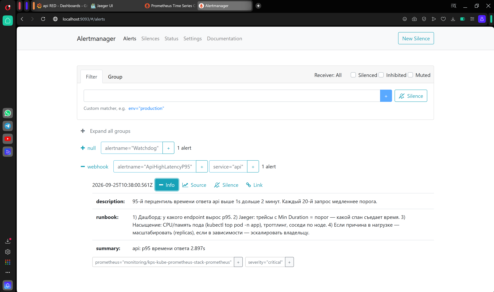

**ApiDown** — просто убиваем сервис:

```bash
kubectl -n app scale deploy/api --replicas=0
```

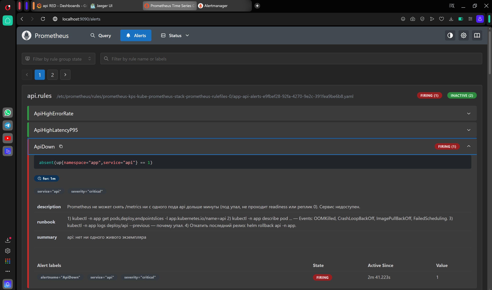

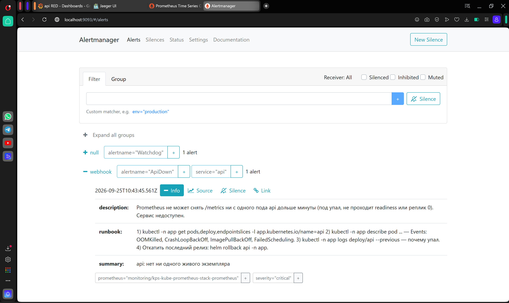

Возвращаем `--replicas=1`, и в webhook прилетает `resolved`.

### Karma

Karma — это UI поверх Alertmanager, нагляднее родного. Сама она ничего не принимает, а просто забирает алерты из API Alertmanager ([`karma.yaml`](./helm/values/karma.yaml)).

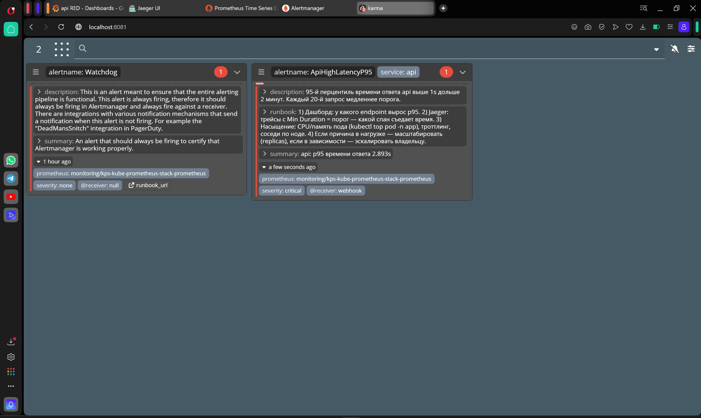

Слева `Watchdog`: он горит **всегда**, и это нормально. Это "мёртвая рука": если он вдруг перестал приходить, значит сломалась сама цепочка алертинга.

## Вывод

В итоге у одного маленького сервиса есть все три сигнала наблюдаемости, и они связаны между собой:

| Сигнал | Инструмент | Отвечает на вопрос |
|---|---|---|
| Метрики | Prometheus + Grafana | **Что** сломалось и насколько (доля ошибок, p95) |
| Логи | Loki + Alloy | **Какая** именно ошибка (текст, поля) |
| Трейсы | OpenTelemetry + Jaeger | **Где** в запросе теряется время или падает |
| Алерты | Alertmanager + Karma | **Когда** пора идти смотреть |

Сценарий разбора инцидента теперь такой: пришёл алерт → на дашборде видно, какой эндпоинт сыпет ошибками → в логах текст ошибки → кнопка Open in Jaeger → видно, на каком спане упало. Всё без `kubectl exec` и чтения кода.

Главные уроки лабы:
- `helm lint` ≠ рабочий манифест. Проверять через `helm template | kubectl apply --dry-run=server`;
- многие вещи ломаются **молча**: ServiceMonitor без нужной метки, OTel без доступного Jaeger, чарт без шаблонов. Надо проверять, что данные реально дошли;
- кардинальность важна: всё уникальное (`user_id`, `trace_id`) не должно становиться меткой ни в Prometheus, ни в Loki;

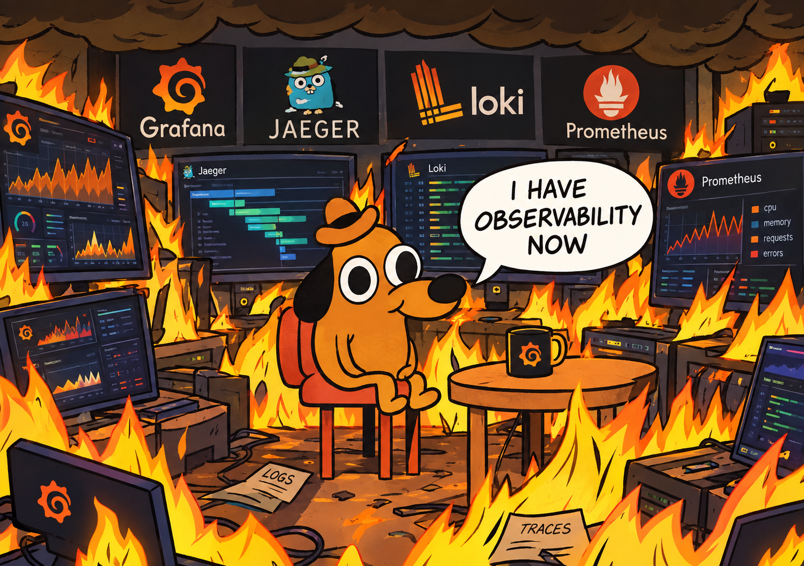
