# Лаба 3 — Собираем платформу для shop

Задание: https://github.com/KeladKaal/containerization-and-orchestration/blob/main-rus/lecture-3-kubernetes-control-plane/lab.md

## Предисловие

После второй лабы у меня был работающий стек мониторинга и наивная уверенность, что Kubernetes я уже немного понимаю. Ну что там: поставить чарты, написать пару YAML'ов...


В этот раз надо было собрать для сервиса `shop` маленькую "платформу": ограждения политикой, Helm-чарт, базу через оператора и мониторинг. Плюс специально уронить control plane и посмотреть, что выживет.

Среда та же, что и в Лабе 2: ВМ в облаке, minikube, стек мониторинга из прошлой лабы. Только теперь кластер я смотрел через **Freelens**, и это сильно помогло. Поды, которые исчезают и появляются, гораздо нагляднее видеть в окошке. В общем, нраица))

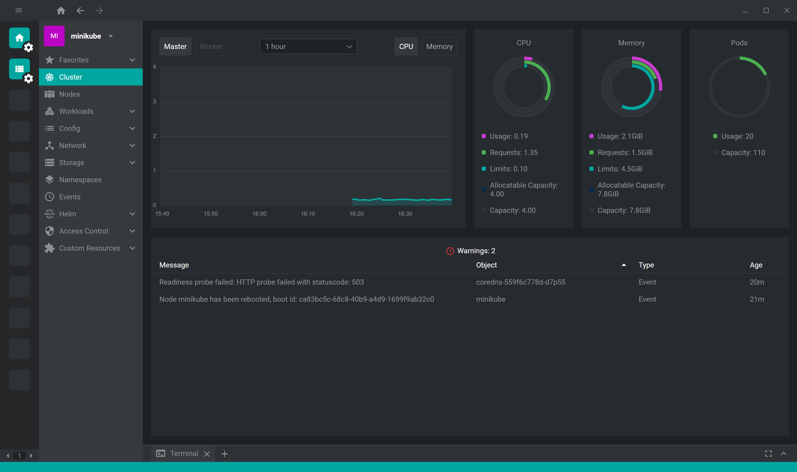

## Часть 0 — Сервисы

Снова Go, снова multistage-сборка в `distroless`. Код: [`./shop/api`](./shop/api) и [`./shop/worker`](./shop/worker).

Эндпоинты `api`:
```
GET  /health    - ok; при HEALTH_FAIL=true отдает 500 (нужно для Части 2)
GET  /version   - версия образа + имя пода (видно, какой под ответил при rolling update)
POST /order     - пишет заказ в postgres
GET  /orders    - отдает список заказов
GET  /metrics   - метрики для Prometheus
```

`worker` раз в 2 секунды забирает новые заказы из postgres (`FOR UPDATE SKIP LOCKED`, чтобы две реплики не хватали один и тот же заказ) и помечает их обработанными.

Пара решений в коде, которые потом сильно пригодились:
- `/health` **не зависит от БД**. Иначе чарт не встал бы до появления postgres, а в Части 4 было бы непонятно, что упало;
- подключение к БД ленивое, с ретраями в фоне. Пока базы нет, поды не уходят в CrashLoop, а `/order` и `/orders` просто отвечают 503;
- graceful shutdown по `SIGTERM`, иначе rolling update без потерь не получится;
- образ `distroless:nonroot` (UID 65532), чтобы пройти политики.

Образы называются `registry.local/shop/{api,worker}:0.1.0`. Реестра `registry.local` не существует, образы собираются сразу в ноду через `minikube image build`. Это нужно было для проверки политики "доверенного реестра".

## Часть 1 — Ограждения на кластер

### Kyverno vs Gatekeeper

Выбрал **Kyverno**:
- правила пишутся как манифесты
- есть autogen. В итоге отказ прилетает сразу на `helm install`, а не потом, когда ReplicaSet не может создать поды
- ставится одним чартом

Ставим Kyverno с урезанными ресурсами и одной репликой admission-контроллера ([`install/kyverno-values.yaml`](./install/kyverno-values.yaml)):

```bash
helm repo add kyverno https://kyverno.github.io/kyverno/ && helm repo update
helm install kyverno kyverno/kyverno -n kyverno --create-namespace -f install/kyverno-values.yaml
```

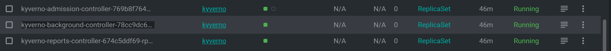

После установки Kyverno сразу заявил, что старый `ClusterPolicy` теперь deprecated. Поэтому все правила написаны на новом `ValidatingPolicy` (`policies.kyverno.io/v1`), где проверки пишутся на CEL. Модель та же, что у нативного `ValidatingAdmissionPolicy` в Kubernetes.

### Правила

Все пять политик лежат в [`./policies`](./policies). Общее у всех:
- режим `Deny`, кластер **отклоняет** нарушителя, а не просто ворчит в отчёт
- autogen
- системные namespace'ы исключены. Иначе стек мониторинга при первом же пересоздании пода упёрся бы в политики

| # | Политика | Что требует | Зачем |
|---|---|---|---|
| 1 | [`require-resource-limits`](./policies/01-require-limits.yaml) | `requests.cpu`, `requests.memory`, `limits.memory` у каждого контейнера (и initContainer'а) | Без requests планировщик не знает, сколько места занимает под, и упихивает на ноду больше, чем влезет. Без лимита памяти один под с утечкой памяти может выесть память всей ноды. Лимит по CPU сознательно **не** требую: он даёт только троттлинг, а не защиту соседей |
| 2 | [`restrict-image-registries`](./policies/02-trusted-registry.yaml) | образ только из `registry.local/shop/` или `ghcr.io/cloudnative-pg/` | Защита от "а давай я быстренько подниму образ с Docker Hub". В проде здесь был бы свой реестр, где образы сканируются и подписываются |
| 3 | [`require-ownership-labels`](./policies/03-require-labels.yaml) | метки `app.kubernetes.io/name` и `app.kubernetes.io/part-of` | Видно, чей это под и к какой системе он относится. По этим же меткам работают Service-селекторы, ServiceMonitor и фильтры в Grafana/Loki |
| 4 | [`disallow-privileged-containers`](./policies/04-disallow-privileged.yaml) | запрет `privileged: true` и `allowPrivilegeEscalation: true` | Privileged-контейнер по сути имеет root на ноде: все capabilities, доступ к устройствам. Побег из такого контейнера стоит одну команду |
| 5 | [`disallow-latest-tag`](./policies/05-disallow-latest.yaml) | явный тег или digest, тег `latest` запрещён | `latest` — это "какая-то версия". Её не откатить (`helm rollback` вернёт тот же `latest`), а k8s для неё ставит `imagePullPolicy: Always`. На этом я споткнулся ещё в Лабе 2 |

Про прод: сразу врубать всё в `Deny` на живом кластере — способ положить половину деплоев. В лабе кластер пустой, поэтому сразу `Deny`, но на проде я бы ставил на политики ресурсов и, возможно, меток `Warn`ы.

### Нарушители

Манифесты в [`./violations`](./violations). Принцип такой: есть [`00-compliant.yaml`](./violations/00-compliant.yaml) — чистый под, который проходит все правила. Каждый следующий файл отличается от него **одним полем**, чтобы нарушалось только одно правило, а не все сразу:

| Файл | Что сломано |
|---|---|
| [`01-no-limits.yaml`](./violations/01-no-limits.yaml) | нет `resources` |
| [`02-foreign-image.yaml`](./violations/02-foreign-image.yaml) | образ с Docker Hub |
| [`03-no-labels.yaml`](./violations/03-no-labels.yaml) | нет меток |
| [`04-privileged.yaml`](./violations/04-privileged.yaml) | `privileged: true` |
| [`05-latest-tag.yaml`](./violations/05-latest-tag.yaml) | `registry.local/shop/api:latest` |

Применял парами "политика → её нарушитель" через `dry-run`:

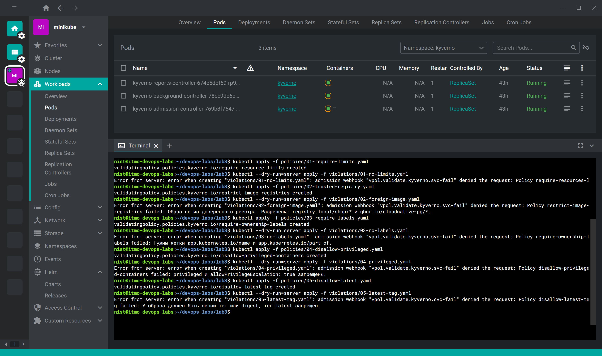

## Часть 2 — Чарт api и worker

### Чарт

Чарт: [`./chart/shop`](./chart/shop). Релиз и чарт называются `shop`, поэтому объекты получаются `shop-api` и `shop-worker`.

Под политики сразу были прописаны ([`values.yaml`](./chart/shop/values.yaml)):
- `requests` cpu/memory и `limits.memory` для сервисов
- образ из `registry.local/shop` с явным тегом
- метки `app.kubernetes.io/name` + `part-of: shop`

И под rolling update:
- `maxSurge: 1`, `maxUnavailable: 0`: новый под поднимается раньше, чем умирает старый
- `preStop: sleep 5`: под успевает пропасть из EndpointSlice до того, как получит `SIGTERM`
- readiness и liveness на `/health`

`DATABASE_URL` берётся из секрета `shop-db-app`, который создаст оператор в Части 3, с `optional: true`. Так чарт ставится и до появления БД

### Установка

И сразу на те же грабли


Первый `helm template | kubectl apply --dry-run=server` сказал `no objects passed to apply`. Потому что я перепутал имя папки🤦‍♂️. Helm, как и в прошлый раз, спокойно ставит чарт без шаблонов и молчит.

Правлю, и снова запускаю:

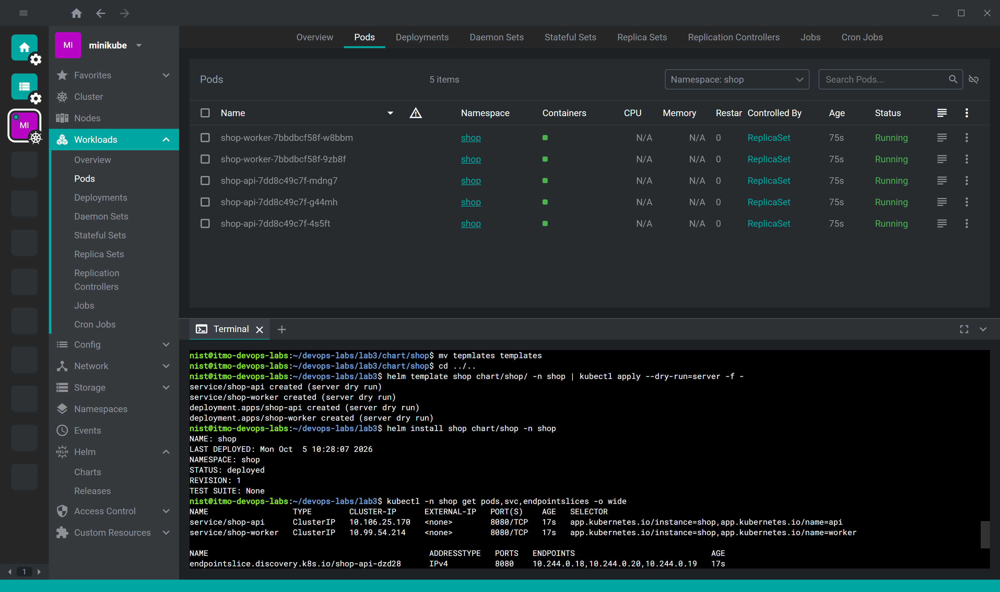

3 пода `api`, 2 пода `worker`, EndpointSlice `shop-api` с тремя IP. `/health` → `ok`, `/version` → `0.1.0`, `/orders` → `503` (потому что еще нет оператора БД).

### Reconciliation

Удаляю под `api` руками:

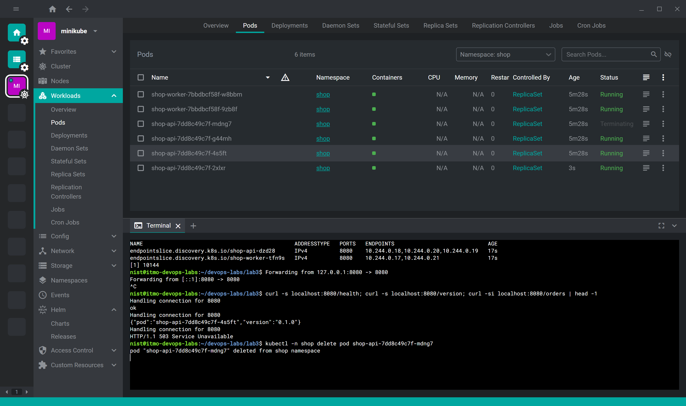

Через 3 секунды уже есть новый `shop-api-...-2xlxr`, а старый `mdng7` всё ещё `Terminating`. ReplicaSet не ждёт, пока старый под умрёт: он видит разницу в `spec` и `status` и сразу создаёт замену.

Теперь меняю `api.replicas` на 4 в `values.yaml` и делаю `helm upgrade`:

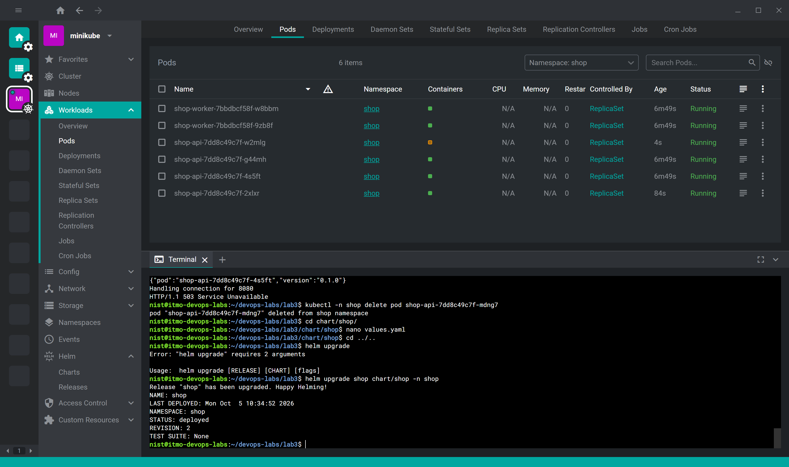

Ревизия 2, появился четвёртый под. Потом вернул 3 (ревизия 3).

### Rolling update

Собираю `api:0.2.0` (тот же код, другой тег), меняю тег в `values.yaml`.

С нагрузкой на `/health` пришлось немного поизвращаться). `kubectl port-forward svc/...` на самом деле привязывается к **одному** поду и умирает вместе с ним, так что посреди rolling update он бы точно отвалился. Поэтому стучался на ClusterIP прямо изнутри ноды:

```bash
IP=$(kubectl -n shop get svc shop-api -o jsonpath='{.spec.clusterIP}')
minikube ssh -- "for i in \$(seq 1 300); do curl -s -o /dev/null -m 2 -w '%{http_code}\n' http://$IP:8080/health; sleep 0.1; done | sort | uniq -c"
```

И параллельно `helm upgrade shop chart/shop -n shop`:

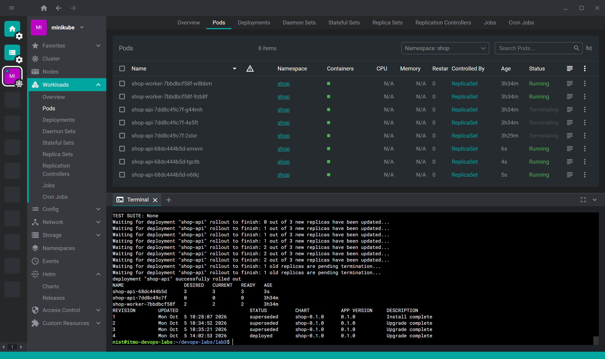

Результат цикла: **`300 200`**, ни одного провала.

`rollout status` показывает `0 → 1 → 2 → 3 of 3 new replicas updated`, а в Freelens видно 3 новых пода и 3 старых в `Terminating`. Новый RS `68dc444b5d` 3/3, старый `7dd8c49c7f` 0/0. Удалять его Deployment не стал: он нужен для отката.

Новые поды действительно 0.2.0:

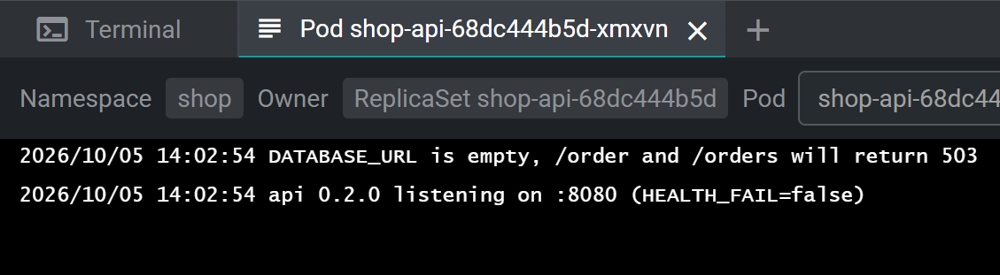

Порядок хорошо видно по событиям Deployment'а:

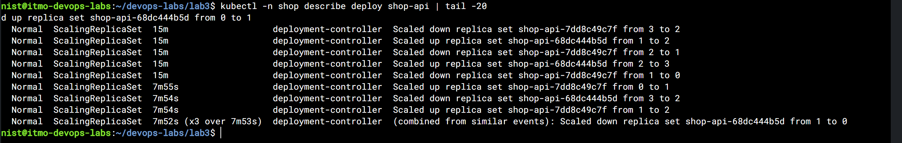

Снизу ещё видно, как я вернул `0.1.0` (ревизия 5): Deployment не создал новый RS, а **переиспользовал** старый `7dd8c49c7f`. Шаблон пода тот же, значит и `pod-template-hash` тот же. На этом же механизме работает `helm rollback`.

### Сломанный релиз

Ставлю `HEALTH_FAIL=true` и катим:

```bash
helm upgrade shop chart/shop -n shop --set api.healthFail=true
kubectl -n shop rollout status deploy/shop-api --timeout=60s
```

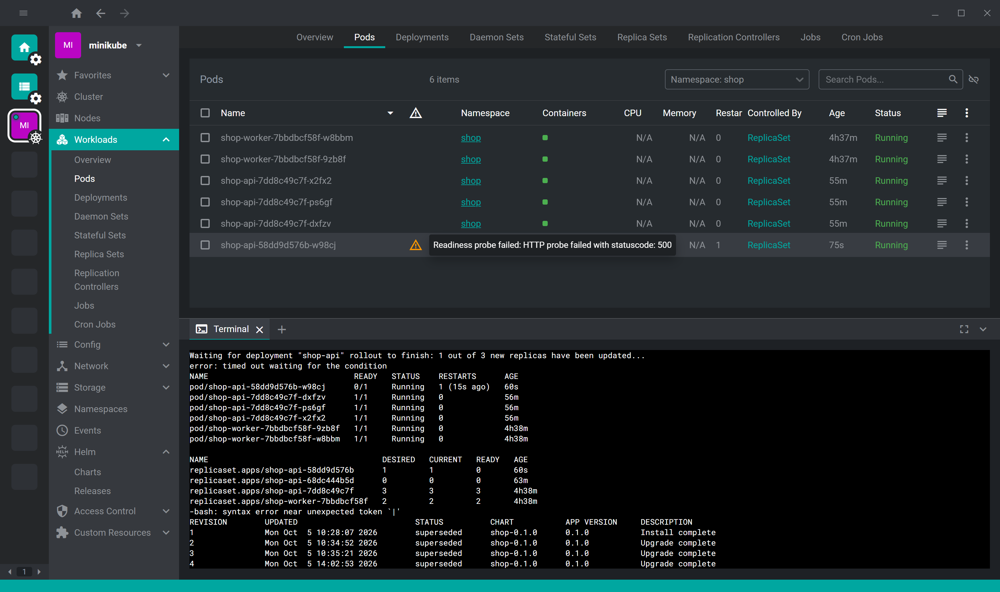

- `rollout status` → `1 out of 3 new replicas have been updated...` → `timed out`;
- новый под `58dd9d576b-w98cj` `0/1`, `Readiness probe failed: HTTP probe failed with statuscode: 500`;
- старые три пода `1/1`, их никто не трогает: `maxUnavailable: 0` не даёт убить старый под, пока новый не готов;
- нагрузка всё это время: **`600 200`**. Сервис отвечал, неготовый под в EndpointSlice не попадает.

Что ещё заметил:
- **`helm upgrade` без `--wait` вернул `deployed`**, хотя rollout висит. Helm считает свою работу сделанной, как только apiserver принял манифесты. Для CI хорошо было бы поставить `--wait`
- новый под ещё и рестартовал (5 рестартов в итоге): liveness смотрит на тот же `/health`, получает 500 и убивает контейнер. Liveness и readiness на одном эндпоинте — это так себе идея: любая проблема, которую видит `/health`, превращается в CrashLoop. По-хорошему liveness должен проверять только "процесс не завис".

Откатываемся:

```bash
helm rollback shop 5 -n shop
```

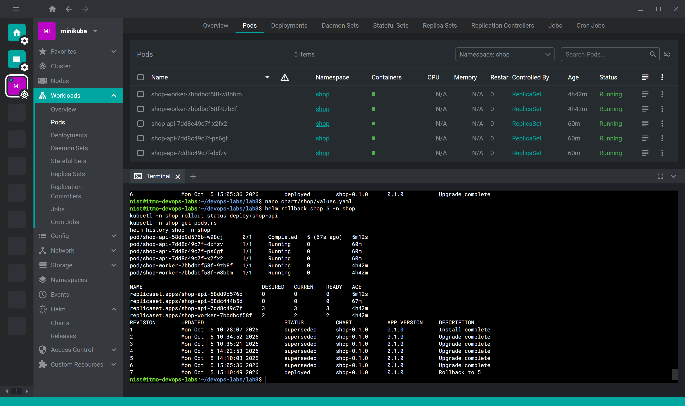

Появилась ревизия **7** с описанием `Rollback to 5`. Номер ревизии не "возвращается назад", откат — это просто новый релиз со старыми values. Рабочий RS `7dd8c49c7f` 3/3 (снова переиспользован), сломанный `58dd9d576b` 0/0, а три рабочих пода (60m) даже не перезапускались, потому что они и так соответствовали ревизии 5.

Полная история релиза к этому моменту:

| Ревизия | Что |
|---|---|
| 1 | install |
| 2 | `api.replicas=4` |
| 3 | `api.replicas=3` |
| 4 | `api` 0.1.0 → 0.2.0 |
| 5 | `api` 0.2.0 → 0.1.0 |
| 6 | `HEALTH_FAIL=true` (сломанная) |
| 7 | rollback to 5 |

## Часть 3 — Postgres через оператора

### CloudNativePG

Оператор ставится один раз на кластер, в `cnpg-system` (этот namespace исключён из политик):

```bash
helm repo add cnpg https://cloudnative-pg.github.io/charts && helm repo update
helm install cnpg cnpg/cloudnative-pg -n cnpg-system --create-namespace
```

В чарт добавлен шаблон [`postgres-cluster.yaml`](./chart/shop/templates/postgres-cluster.yaml): объект `Cluster` с одним инстансом, 1Gi диска, базой и владельцем `shop`. Чтобы поды БД прошли политики:
- метки `name: postgres` и `part-of: shop` передаются через `inheritedMetadata`;
- лимиты через `spec.resources`;
- образ не задаю, оператор подставляет свой по умолчанию — `ghcr.io/cloudnative-pg/postgresql:18.6-system-trixie`. Доверенный реестр, явный тег, так что политики 2 и 5 довольны.

После `helm upgrade` оператор за секунду создал секреты `shop-db-app` (там лежит готовый `uri` для подключения), `shop-db-ca`, `shop-db-server`, `shop-db-replication`, а потом и под `shop-db-1`. Политики ничего не отклонили. Делаем `rollout restart` для `api`/`worker`, чтобы они подхватили `DATABASE_URL` из появившегося секрета, и пробуем создать заказ:

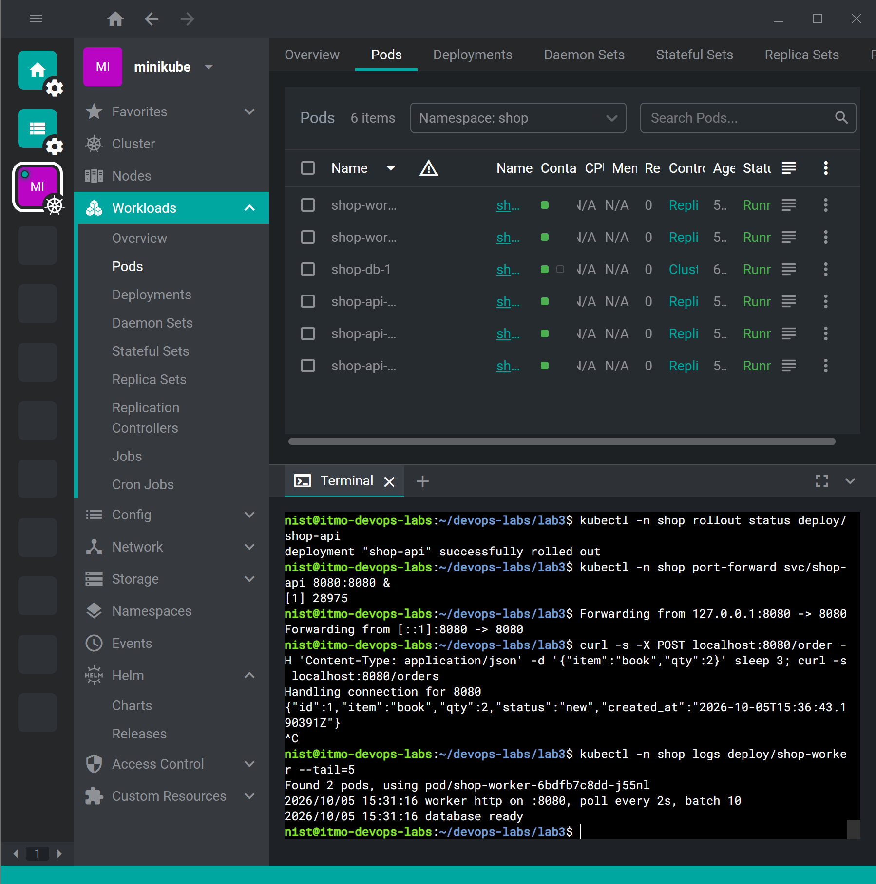

`{"id":1,"item":"book","qty":2,"status":"new",...}`, цепочка `api → postgres` работает. Через пару секунд заказ уходит в `status: processed`

### Удаляем под postgres

```bash
kubectl -n shop delete pod shop-db-1
```

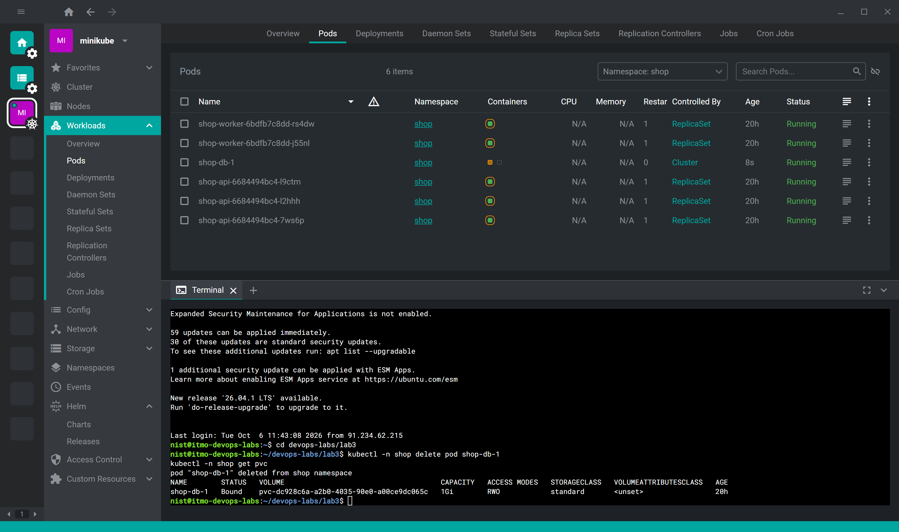

Через несколько секунд под снова `Running`, с **тем же именем** `shop-db-1` и `Controlled By: Cluster`. PVC `shop-db-1` тот же, поэтому `GET /orders` после пересоздания показывает заказ на месте: данные пережили удаление пода.

### spec и status

**`spec`** — то, что хочу я. Там мои поля из чарта (`instances: 1`, `storage.size: 1Gi`, `bootstrap.initdb`, `inheritedMetadata`, `resources`) плюс куча дефолтов, которые webhook оператора добавил сам.

**`status`** — то, что есть на самом деле, и пишет его только оператор:
- `phase: Cluster in healthy state`, `readyInstances: 1`;
- `currentPrimary: shop-db-1`, `targetPrimary: shop-db-1`;
- `healthyPVC: [shop-db-1]`;
- `conditions`: `Ready`.

### Оператор vs controller-manager

По сути это один и тот же паттерн: бесконечный цикл reconciliation "сравни `spec` с реальностью → приведи реальность к `spec` → запиши в `status`". Разница в том, **что** контроллер знает.

| | kube-controller-manager | Оператор CloudNativePG |
|---|---|---|
| Ресурсы | Встроенные: Deployment, ReplicaSet, Node, Job... | Свои, через CRD: `Cluster`, `Backup`, `Pooler` |
| Откуда | Часть control plane, есть в любом кластере | Ставится отдельно, как обычное приложение в своём namespace |
| Знания | Общие, ничего не знает о том, что внутри пода. Для него postgres — "какой-то контейнер" | Знает предметную область: что такое primary/replica, WAL, initdb, как сделать switchover, как ротировать сертификаты |
| Что делает при удалении пода | ReplicaSet создаёт новый под со случайным именем, состояние ему не важно | Возвращает под с тем же именем на тот же PVC, проверяет, кто сейчас primary, при необходимости делает failover |
| Что создаёт | Поды | Поды, PVC, Services `-rw`/`-r`, секреты с паролями и сертификатами, PDB, конфиг postgres |

То есть оператор берёт на себя эксплуатационную рутину, которую controller-manager делать не умеет, потому что ничего не знает про специфику базы данных.

И важное следствие: оператор — это **просто под**. Если его нет, никто не вернёт базу.

## Часть 4 — Падение control plane

Роняю apiserver. В minikube это static pod, поэтому достаточно убрать его манифест, и kubelet сам погасит под.

### Что сломалось

- `kubectl get pods` → `The connection to the server 192.168.49.2:8443 was refused`
- фоновый `kubectl port-forward` умер (`Exit 1`)
- `helm upgrade ... --set api.replicas=5` → `Kubernetes cluster unreachable`
- `kubectl apply` → туда же
- Freelens:

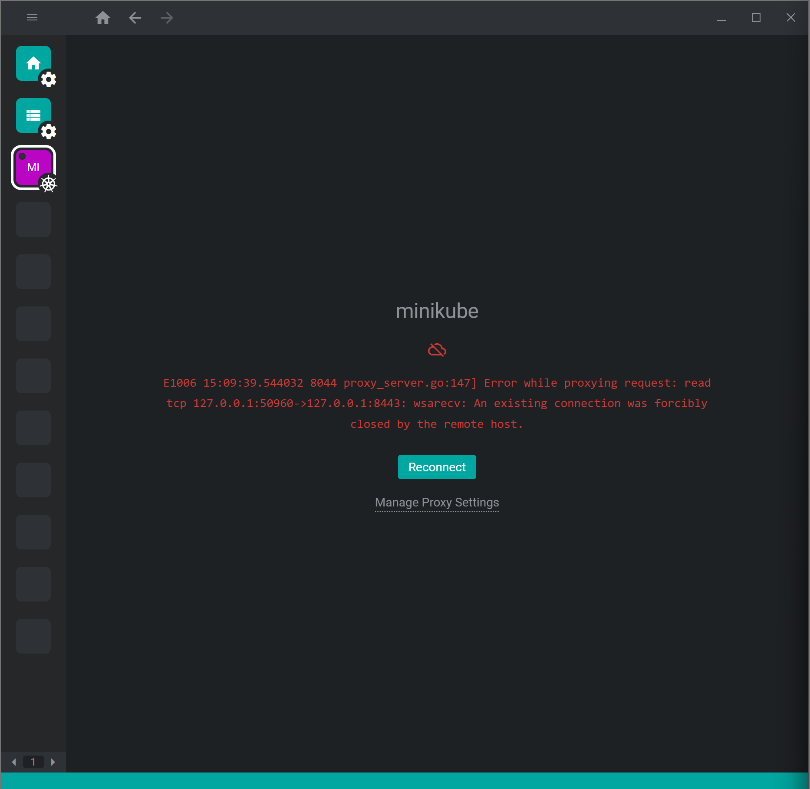

### Что выжило

Стучимся изнутри ноды по ClusterIP:

```bash
minikube ssh -- curl -s http://$API_IP:8080/health
minikube ssh -- curl -s http://$API_IP:8080/orders
minikube ssh -- "curl -s -X POST http://$API_IP:8080/order -H 'Content-Type: application/json' -d '{\"item\":\"during-outage\",\"qty\":1}'"
```

- `/health` → `ok`;
- `/orders` → заказ `id=1` в статусе `processed`;
- `POST /order` → заказ `id=2` создан в `12:10:45.67`, а через ~0.8 с worker уже пометил его `processed`.

Сервисы и БД даже не заметили, что control plane упал, ведь контейнеры запускает и держит kubelet, у него закэширован spec подов:
- трафик между подами идёт через правила iptables, которые kube-proxy уже прописал
- DNS (coredns) работает из своего кэша
- соединение `api → postgres` — обычный TCP между подами, apiserver в нём не участвует

А вот всё, что требует **изменений**, не работает: деплой, скейлинг, а оператор не вернёт базу. Kubelet перезапустит упавший контейнер, но новый под без apiserver не встанет.

### Восстановление

```bash
minikube ssh -- sudo mv /tmp/kube-apiserver.yaml /etc/kubernetes/manifests/
```

Сразу после возврата было интересно:
- клиенты API, которые держат leader election, попадали и ушли в CrashLoop с backoff: `cnpg-cloudnative-pg` (7 рестартов), Kyverno admission/background/reports, `storage-provisioner`;
- и первый `helm upgrade` упал:

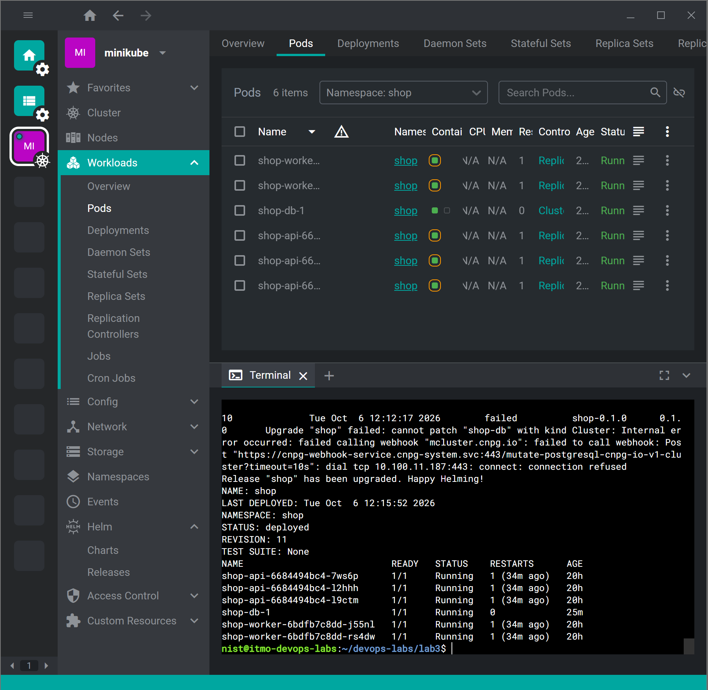

apiserver уже живой, а webhook оператора CNPG ещё нет. С Kyverno та же история. Webhook'и стоят **на пути записи**, и их доступность становится частью доступности самого кластера.

Подождал, пока оператор поднимется, повторил. Все 6 подов `shop` за всё время ни разу не перезапустились из-за падения.

Итого: кластер снова управляем, но не мгновенно. "apiserver вернулся" и "кластер готов принимать изменения" — это, как оказалось, разные моменты, между ними несколько минут backoff'ов.

## Часть 5 — Мониторинг

### ServiceMonitor, PrometheusRule, дашборд

Переиспользуем тот же стэк, что уже был поднят на ВМке во 2 лабе. Там уже включены `serviceMonitorSelectorNilUsesHelmValues: false` и `ruleSelectorNilUsesHelmValues: false`, так что Prometheus подхватит объекты из любого namespace без метки `release`.

В чарт добавлены:
- [`servicemonitor.yaml`](./chart/shop/templates/servicemonitor.yaml) — один ServiceMonitor на `api` и `worker`
- [`prometheusrule.yaml`](./chart/shop/templates/prometheusrule.yaml) — новые алерты
- [`dashboard.yaml`](./chart/shop/templates/dashboard.yaml) + [`dashboards/shop.json`](./chart/shop/dashboards/shop.json) — ConfigMap для Grafana

И тут я немного выпал. Первый `helm upgrade` упал с `function "handler" not defined`. Ища 10 минут, откуда это взялось, я узнал, что Helm оказывается исполняет {{ }}-блоки даже в комментариях. Не понял зачем и как, но допустим... Убрал коммент из Yaml`ика и все заработало.

Цели в Prometheus — 5/5 UP (3 `api` + 2 `worker`):

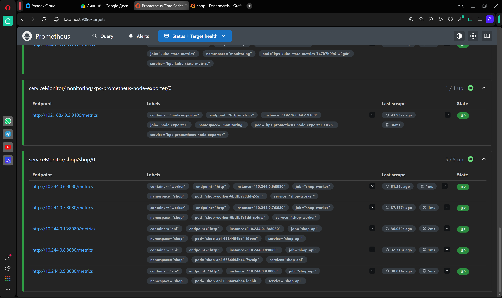

Дашборд в обычном состоянии:

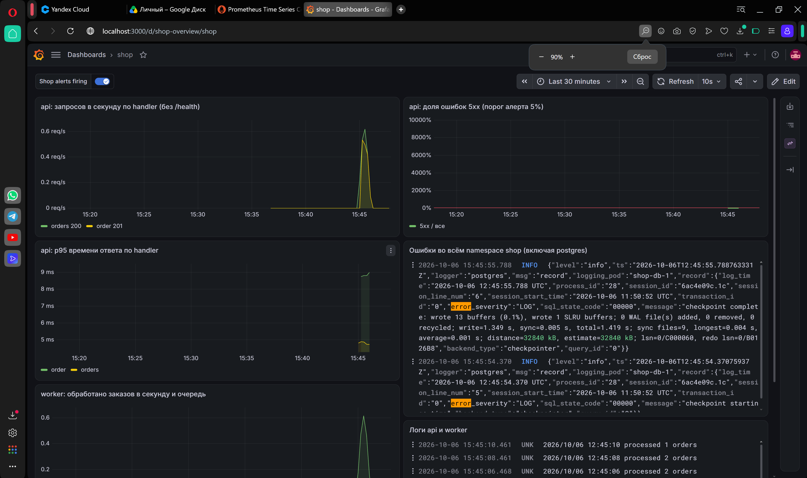

### Алерты

Все три `severity: critical`, поэтому Alertmanager шлёт их в webhook. У каждого есть `summary`, `description` и `runbook`.

**1. `ShopApiHighErrorRate`** — больше 5% ответов `api` (кроме `/health`) заканчиваются 5xx в течение 2 минут. Это алерт на **симптом**: что видит пользователь.

**2. `ShopDatabaseUnavailable`** — `max(api_db_ready) == 0` в течение минуты, т.е. **ни одна** реплика `api` не может достучаться до postgres. Это алерт на **причину**. Когда прилетает ShopApiHighErrorRate, сразу понятно, что дело не в коде, а в базе и надо смотреть туда.

**3. `ShopWorkerStalled`** — ни один `worker` не завершил успешный опрос БД больше 60 секунд. Это **тихая** поломка: `worker` живой, `/health` отвечает `ok`, пробы зелёные, пользователь получает свой `201` на `POST /order`... а заказы просто копятся в статусе `new`. Без отдельного алерта такое можно не заметить.

### Провоцируем

Вспоминаем, чтр если оператора нет, базу никто не вернёт:

```bash
kubectl -n cnpg-system scale deploy/cnpg-cloudnative-pg --replicas=0
kubectl -n shop delete pod shop-db-1
```

Через пару минут на дашборде всё красное, а аннотации показывают время, когда алерты ушли в firing:

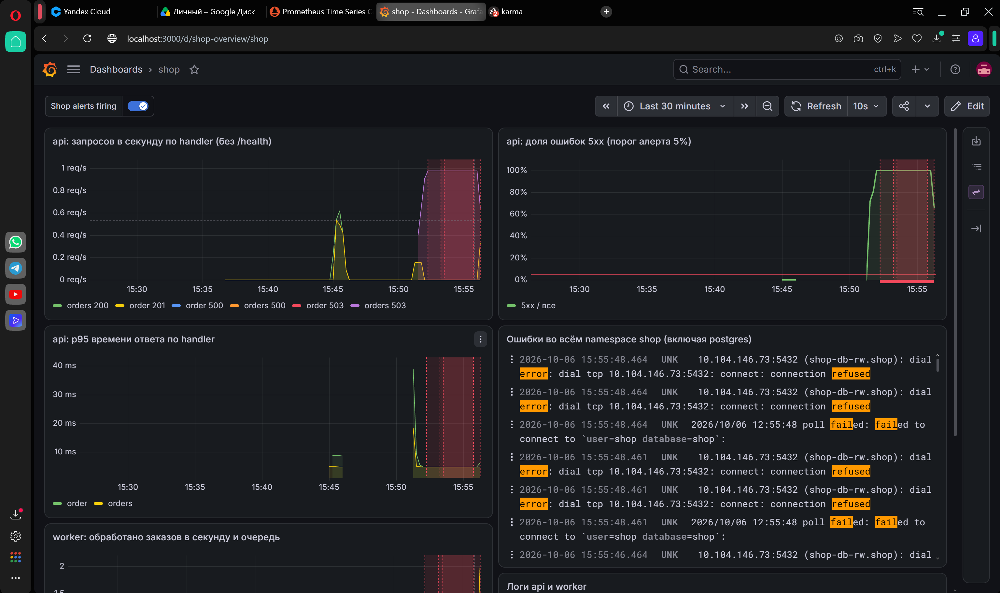

Доля 5xx 100%, `/orders` и `/order` отвечают 503, в логах `dial tcp ...:5432: connect: connection refused` и `poll failed`.

И все три алерта в Karma в состоянии firing:

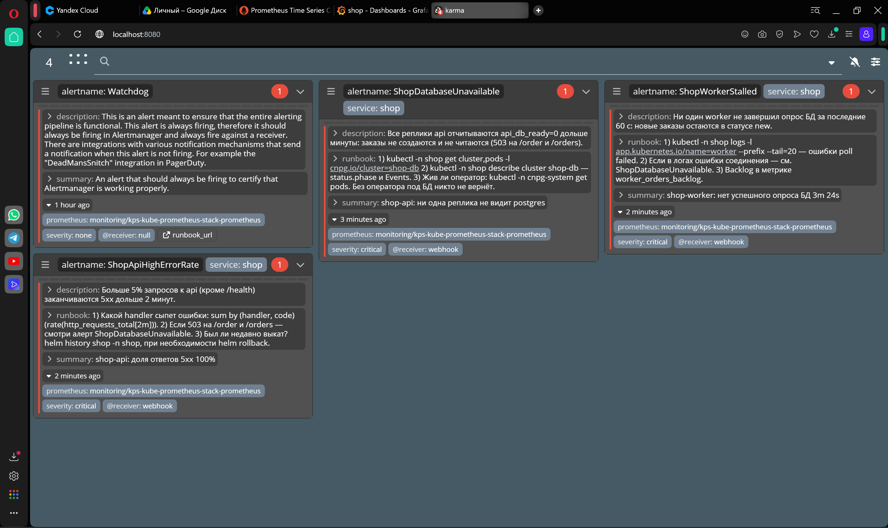

Возвращаем оператор (`--replicas=1`), он поднимает `shop-db-1` на том же PVC, алерты уходят в `resolved`.

## Вывод

Что получилось в итоге:
- на кластере стоят 5 политик Kyverno, и они режут нарушителей
- чарт `shop` встаёт под этими политиками
- поды `api` возвращает ReplicaSet, под `postgres` возвращает оператор, причём на тот же диск
- rolling update проходит без потерь, сломанный релиз зависает, не трогая рабочие поды, и откатывается одной командой
- при падении apiserver `shop` продолжает принимать и обрабатывать заказы
- дашборд и 3 алерта поверх уже поднятого стека 

Главные уроки лабы:
- **Kubernetes — это control loop'ы.**: смотрим `spec`, приводим к нему состояние и пишем `status`. Оператор — это тот же паттерн, просто со знанием предметной области
- **control plane ≠ data plane.** Без apiserver приложение работает, но кластер "замерзает": ничего нельзя поменять и никто ничего не починит
- **webhook'и стоят на пути записи.** Kyverno и оператор с `failurePolicy: Fail` делают любые изменения зависимыми от своей доступности. Хорошо для безопасности, плохо, если они лежат
- **`helm upgrade` без `--wait` врёт.** `deployed` значит "манифесты приняты", а не "всё работает"
- **liveness ≠ readiness.** Одинаковые пробы на одном эндпоинте превращают любую проблему в CrashLoop
- и вечное: многое ломается **молча** — `minikube image build` без `go.sum`, чарт без папки `templates`, `{{ }}` в комментарии
