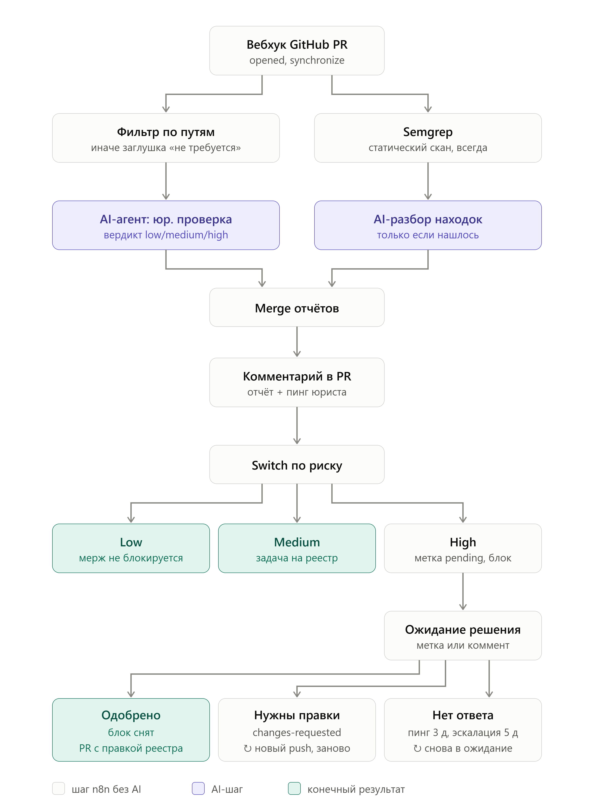

# Лаба 8 — Автоматизация devops-процесса с n8n + AI

Задание: https://github.com/KeladKaal/containerization-and-orchestration/tree/main-rus/lecture-8-ai

## Часть 1 — Кейс и боль компании

За контекст компании возьмем маленький медтех-стартап. **Проект** — медицинское мобильное приложение (функционал опустим, он не столь важен). Проект выходит на этап MVP, на сервере запущены 3 микросервиса: аутентификация, биллинг для оформления подписок и бэкенд сервис приложения. Есть мобильное приложение и сайт с информацией.

**Команда** состоит из 3 человек:
 - Фронтендер — на нем сайт и мобильное приложение
 - Бэкендер — весь бэк сервисов. На нем же лежат функции devops`а
 - Юрист (он же `запасной` разработчик) — В основном отвечает за юридические документы, согласия, ПДн. Иногда, при надобности, подключается к процессу разработки (В общем, и швец и жнец).

Главной болью стартапа, особенно в медтехе, как оказалось, является не нехватка людей для разработки и даже не отсутствие денег на развитие, а великий и ужасный **152-ФЗ**.

Поэтому я придумал процесс автоматизации с пафосным названием **"Страж персональных данных"**, который должен помогать юристу и разработчикам отслеживать собираемые данные и их статус в согласиях, а также ловить потенциальные утечик в коде.

**Триггер:** новый PR в GitHub. Workflow ищет новые файлы миграций sql-builder`a, новые зависимости и запускает статические проверки кода на поиск потенциальных уязвимостей. Затем параллельно запускаются две ветки:
 - Агент проверяет файлы миграций на предмет появления новых полей в БД, которые в теории могут являтся персональными данными и ищет куда они могут передаваться, потом формирует отчет с уровнем риска PR.  
 - Второй агент запускает secutiry audit по результату статических проверок, чтобы подтвердить или опровергнуть наличие уязвимостей связанных с персональными данными, формирует отчет о проверке.

После работы агентов отчеты склеиваются и публикуются в комментарий к реквесту с опциональным пингом юриста (и меткой с требованием юридической проверки) и блоком мерджа при высоком уровне риска. В итоговом отчете содержаться новые поля БД, которые являются персональными данными, предложения по правкам документов или аргументация почему эти данные не стоит добавлять и уровень риска (`low|mid|high`) по всему PR.

## Часть 2 — Реализация workflow

- [✅] **Триггер**. Вебхук с GitHub на открытие нового PR в main ветке и synchronize на новый пуш в тот же реквест.
- [✅] **И AI, и не AI-шаги**. Есть шаги агентов, с юридической проверкой и разбор security audit. И есть шаги n8n: фильтр изменений, статический скан на уязвимости, мердж веток отчета, публикация коммента в PR, установка меток и блока на мердж реквеста.
- [✅] **MCP-сервера**. GitHub MCP с токеном только на чтение diff PR и содержимого файлов для агента. Filesystem MCP для чтения актуальных юридических документов на сервере.
- [✅] **AI toolkit**. `get_pr_diff` (GitHub MCP) возвращает изменённые файлы и diff. Вход: `owner`, `repo`, `pull_number`. `get_file_contents` (GitHub MCP) возвращает файл целиком на ветке PR: миграцию, прошлые миграции таблицы, модуль с логированием. Вход: `owner`, `repo`, `path`, `ref`. `read_legal_docs` (filesystem MCP) возвращает все актуальные документы: согласие на обработку ПДн, пользовательское соглашение, медицинский дисклеймер. `get_package_info` (HTTP Request Tool → npm registry) возвращает описание, homepage и репозиторий пакета, чтобы понять, куда он отправляет данные. Вход: package_name.
- [✅] **Описанные skills**. Скиллы агентов находятся в [`./skills`](./skills)
- [✅] **Конкретный результат**:
 - Комментарий-отчёт в PR с пингом юриста: что найдено, почему это ПДн, чего не хватает в документах, находки аудита.
 - Метка и статус-чек по уровню риска: при high мерж заблокирован до решения юриста.
 - После одобрения автоматически открывается PR с правкой реестра или документов.
 - При отказе ставится метка legal-review:changes-requested, после исправления проверка запускается заново.

## Часть 3 — локальный запуск
